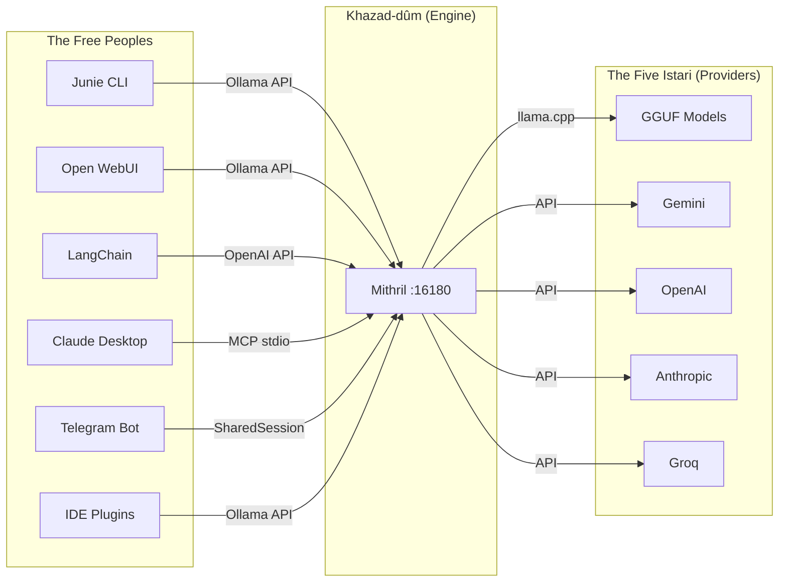

# Mithril

> *"Mithril! All folk desired it. It could be beaten like copper, and polished like glass; and the Dwarves could make of it a metal, light and yet harder than tempered steel."* — Gandalf

**A lightweight standalone LLM inference engine forged in the depths of Khazad-dûm.** Single binary, no runtime dependencies. Serves GGUF models via Ollama-compatible API, OpenAI-compatible API, and MCP stdio — works with Junie, Open WebUI, LangChain, Claude Desktop, and any Ollama client.

[](https://doc.rust-lang.org/cargo/)
[](LICENSE)
[]()

---

## The Forging

Mithril is the backend engine powering [Celebrimbot](https://github.com/GiacomoSaccaggi/Celebrimbot) — ported from Kotlin/JVM to pure Rust. Like the legendary metal of the Dwarves, it is light yet stronger than steel: a single binary that serves local models and cloud providers alike.



---

## Gifts of the Elves

| Gift | Description |
|------|-------------|
| **Single Binary** | No JVM, no Python — one ring to rule them all |
| **Cross-Platform** | macOS, Linux, Windows |
| **Minas Tirith TUI** | Full ratatui terminal interface with splash animation |
| **The Beacons** | Ollama `/api/*`, OpenAI `/v1/*`, MCP JSON-RPC endpoints |
| **Five Istari** | Local GGUF + Gemini, OpenAI, Anthropic, Groq providers |
| **The Armory** | 24 built-in MCP tools for file, git, web, and code operations |
| **The Fellowship** | Multi-agent orchestration with GGUF classifier + NEXT/TASK protocol |
| **@Agent Mentions** | Direct agent addressing in chat via `@worker`, `@reviewer` |
| **Markdown Agents** | Define agents in `.mithril/agents/*.md` with natural language |
| **Token Streaming** | True token-by-token via `mpsc` channel bridge |
| **Palantír Index** | BM25 semantic search for fast project context retrieval |
| **Shadow Log** | Automatic backup/undo for all file operations |
| **Session Persistence** | Auto-titled sessions with handoff between Terminal, Telegram, Junie |
| **Plan↔Build Mode** | Tab toggles between read-only analysis and full-access editing |
| **Hooks & Formatters** | Pre/post hooks and output formatters in fellowship config |
| **Custom Commands** | Define `/commands` in fellowship YAML |
| **Lazy Loading** | Model loaded on first inference, auto-unloaded after idle |
| **Metal GPU** | Automatic acceleration on Apple Silicon |
| **Argon2id Vaults** | AES-256-GCM encrypted credentials with proper KDF |
| **Terminal Sanctuary** | Dangerous commands blocked, path traversal prevented |
| **Retry with Backoff** | Exponential backoff on provider failures |
| **Token Budget** | Per-agent usage accounting and limits |

---

## Quick Start

> *"The road goes ever on and on, down from the door where it began."*

### One Command Installation

```bash
curl -fsSL https://raw.githubusercontent.com/GiacomoSaccaggi/mithril/main/install.sh | bash
```

### Manual Installation

```bash
# macOS (Apple Silicon)
curl -L https://github.com/GiacomoSaccaggi/mithril/releases/latest/download/mithril-macos-arm64.tar.gz | tar xz
sudo mv mithril /usr/local/bin/

# Linux (x86_64)
curl -L https://github.com/GiacomoSaccaggi/mithril/releases/latest/download/mithril-linux-x64.tar.gz | tar xz
sudo mv mithril /usr/local/bin/

# Build from source
git clone https://github.com/GiacomoSaccaggi/mithril.git
cd mithril && cargo build --release
```

### First Journey

```bash
# Configure a provider (keys stored encrypted)
mithril config set gemini "AIza..."

# Begin your quest
mithril start
```

---

## The Fellowship System

> *"I will take the Ring, though I do not know the way."*

Every `mithril chat` session is orchestrated by a Fellowship — a multi-agent system defined in `.mithril/fellowship.yaml`:

```yaml
name: "fellowship-of-code"
description: "A company of agents united in purpose"

controller:
  provider: local
  model: qwen-1.5b
  context_window: 2

max_rounds: 15
token_budget: 50000

agents:
  - name: "worker"
    provider: gemini
    model: gemini-2.5-flash
    role: "Swift executor of tasks"
    when: "any task requiring action"
    can_call: ["reviewer", "gguf"]
    tools: ["*"]

  - name: "reviewer"
    provider: gemini
    model: gemini-2.5-pro
    role: "Wise counsel for complex matters"
    when: "explicit review request"
    can_call: ["worker"]
    tools: ["read_file", "grep_files", "git_diff"]
```

### Agent Communication Protocol

Agents speak through the NEXT/TASK protocol:

| Protocol | Meaning |
|----------|---------|
| `NEXT: DONE` | Quest complete — return to the user |
| `NEXT: agent_name` | Pass the torch to another agent |
| `TASK: description` | The burden to carry forward |

### @Agent Mentions

Address agents directly in your messages:

```
@reviewer please check my changes to auth.rs
@worker implement the fix that reviewer suggested
```

### Markdown Agents

Define agents in natural language at `.mithril/agents/loremaster.md`:

```markdown
# Loremaster

You are the keeper of project knowledge. You excel at:
- Explaining complex code
- Finding relevant documentation
- Answering questions about architecture
```

---

## The Sixteen Commands

| Command | Purpose |
|---------|---------|
| `mithril start` | Server + chat in one command |
| `mithril serve` | HTTP server only |
| `mithril chat` | Interactive TUI (or `--plain` for REPL) |
| `mithril exec` | Non-interactive execution for scripts |
| `mithril flow` | Run agentic Planner→Tools loop |
| `mithril fellowship` | Multi-agent orchestration |
| `mithril fellowships` | List available fellowships |
| `mithril forge` | Single inference and print |
| `mithril init` | Generate MITHRIL.md steering file |
| `mithril scan` | Build Palantír BM25 index |
| `mithril config` | Manage credentials and settings |
| `mithril download-model` | Download GGUF models |
| `mithril mcp-stdio` | MCP server over stdin/stdout |
| `mithril telegram` | Start Telegram bot frontend |
| `mithril sessions` | Manage saved sessions |
| `mithril undo` | Undo last shadow log session |

---

## The Armory (24 Tools)

> *"It's a dangerous business, going out your door."*

### File Operations
`read_file`, `write_file`, `edit_file`, `delete_file`, `apply_patch`

### Terminal
`run_terminal` (with sanctuary protection)

### Discovery
`list_files`, `grep_files`, `find_file`, `file_stats`

### Git Mastery
`git_status`, `git_log`, `git_diff`, `git_blame`, `git_branch`, `git_commit`

### Web Scouting
`web_search`, `fetch_page`

### Code Intelligence
`search_symbols`, `document_outline`

### Project Lore
`lore_write`, `lore_read`

### Session Control
`share_session`

---

## Documentation

> *"All we have to decide is what to do with the time that is given us."*

| Scroll | Contents |
|--------|----------|
| [docs/ARCHITECTURE.md](docs/ARCHITECTURE.md) | The realms of Mithril: Khazad-dûm, Rivendell, Minas Tirith |
| [docs/TOOLS.md](docs/TOOLS.md) | The twenty-four weapons of the Armory |
| [docs/CLI.md](docs/CLI.md) | Commands, /chat commands, @mentions, custom commands |
| [docs/SECURITY.md](docs/SECURITY.md) | The defenses of the realm |
| [docs/SESSION.md](docs/SESSION.md) | Session persistence and handoff |
| [docs/PROVIDERS.md](docs/PROVIDERS.md) | The Five Istari (providers) |
| [docs/ENGINE.md](docs/ENGINE.md) | Khazad-dûm depths: LazyModelManager, streaming |
| [docs/API.md](docs/API.md) | The Beacons: HTTP endpoints |
| [docs/OPERATORS.md](docs/OPERATORS.md) | The Rangers: file, git, web operators |
| [docs/INDEX.md](docs/INDEX.md) | The Palantír: BM25 semantic index |
| [docs/TOKEN_EFFICIENCY.md](docs/TOKEN_EFFICIENCY.md) | Wisdom in token usage |
| [CONTRIBUTING.md](CONTRIBUTING.md) | Join the Fellowship |

---

## API Endpoints

| Endpoint | Description |
|----------|-------------|
| `GET /health` | Health check |
| `GET /api/tags` | List models |
| `POST /api/chat` | Chat completion (Ollama) |
| `POST /api/generate` | Text generation (Ollama) |
| `POST /v1/chat/completions` | Chat completion (OpenAI) |
| `GET /v1/models` | Model list (OpenAI) |
| `POST /mcp` | MCP JSON-RPC 2.0 |

---

## Prerequisites

### macOS
```bash
brew install cmake && xcode-select --install
```

### Linux
```bash
sudo apt install build-essential cmake
```

### Rust
```bash
curl --proto '=https' --tlsv1.2 -sSf https://sh.rustup.rs | sh
```

---

## License

MIT

---

> *"Even the smallest person can change the course of the future."*
