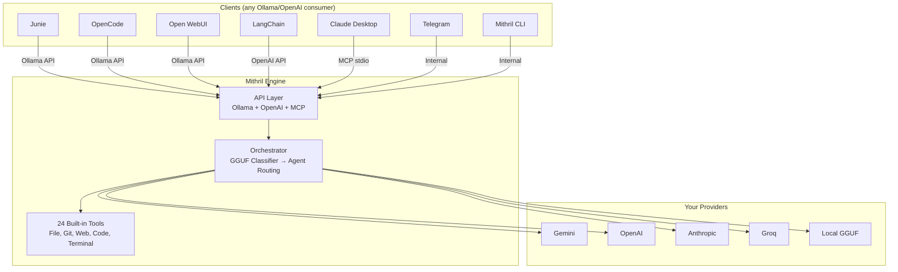

# Mithril

> *"Mithril! All folk desired it. It could be beaten like copper, and polished like glass; and the Dwarves could make of it a metal, light and yet harder than tempered steel."* — Gandalf

**A multi-model orchestration engine.** Combine any mix of LLM providers (Gemini, OpenAI, Anthropic, Groq, local GGUF) into a single Ollama-compatible API endpoint. Configure who does what in a YAML file, then point any AI tool at it.

[](https://doc.rust-lang.org/cargo/)
[](LICENSE)
[]()

---

## What It Does

You define a **fellowship** — a team of AI models working together:

```yaml
# .mithril/fellowship.yaml
name: "my-team"
controller:
  provider: local          # Free GGUF model routes requests
  model: qwen-1.5b

agents:
  - name: coder
    provider: gemini
    model: gemini-2.5-flash
    when: "coding tasks"
    tools: ["*"]

  - name: reviewer
    provider: openai
    model: gpt-4o
    when: "code review requested"
    tools: ["read_psi", "grep_files"]
```

Then you start the engine:

```bash
mithril serve
```

Now any Ollama-compatible client sees your fellowship as a model:

```bash
# From Junie, OpenCode, Open WebUI, or any Ollama client:
curl http://localhost:16180/api/tags
# → {"models": [{"name": "my-team:latest", "details": {"family": "mithril-fellowship"}}]}
```

---

## Use Cases

| Use Case | How |
|----------|-----|
| **Backend for Junie** | Point Junie at `http://localhost:16180`, select your fellowship as the model |
| **Backend for OpenCode** | Same — Ollama API compatible |
| **Backend for Open WebUI** | Add as Ollama connection |
| **Backend for LangChain** | Use OpenAI API at `http://localhost:16180/v1/chat/completions` |
| **MCP server for Claude Desktop** | `mithril mcp-stdio` |
| **Standalone CLI** | `mithril chat` — built-in terminal interface |
| **Docker service for teams** | `docker compose up` — shared orchestration backend |
| **Telegram bot** | `mithril telegram` — chat via Telegram with same fellowship |

---

## Architecture



---

## Installation

### One-liner
```bash
curl -fsSL https://raw.githubusercontent.com/GiacomoSaccaggi/mithril/main/install.sh | bash
```

### Manual
```bash
# macOS (Apple Silicon)
curl -L https://github.com/GiacomoSaccaggi/mithril/releases/latest/download/mithril-macos-arm64.tar.gz | tar xz
sudo mv mithril /usr/local/bin/

# Linux (x86_64)
curl -L https://github.com/GiacomoSaccaggi/mithril/releases/latest/download/mithril-linux-x64.tar.gz | tar xz
sudo mv mithril /usr/local/bin/
```

### Docker
```bash
git clone https://github.com/GiacomoSaccaggi/mithril.git
cd mithril
docker compose up -d
# API available at http://localhost:16180
```

### Build from source
```bash
git clone https://github.com/GiacomoSaccaggi/mithril.git
cd mithril && cargo build --release
```

---

## Quick Start

### 1. Configure providers

```bash
# API keys — stored encrypted with Argon2id + AES-256-GCM
mithril config set gemini "AIza..."
mithril config set openai "sk-..."

# Or via environment variables (for Docker/CI):
export MITHRIL_KEY_GEMINI="AIza..."
export MITHRIL_KEY_OPENAI="sk-..."
```

### 2. Create a fellowship

```bash
mithril fellowship init
# Creates .mithril/fellowship.yaml with sensible defaults
```

### 3. Start the engine

```bash
mithril serve
# → http://localhost:16180 (Ollama + OpenAI + MCP)
```

### 4. Connect your tools

**Junie / OpenCode / Open WebUI:**
- Ollama URL: `http://localhost:16180`
- Model: select your fellowship name from the list

**LangChain / custom:**
```python
from openai import OpenAI
client = OpenAI(base_url="http://localhost:16180/v1", api_key="unused")
response = client.chat.completions.create(
    model="my-team",
    messages=[{"role": "user", "content": "Review this code"}]
)
```

---

## Credentials in Docker

Mithril reads API keys in this priority order:

1. **Environment variables** (recommended for Docker): `MITHRIL_KEY_<PROVIDER>`
2. **Encrypted config file**: `~/.mithril/config.yaml` (used by CLI)

```bash
# Docker Compose — set in .env file or environment:
MITHRIL_KEY_GEMINI=AIza...
MITHRIL_KEY_OPENAI=sk-...
MITHRIL_KEY_ANTHROPIC=sk-ant-...
MITHRIL_KEY_GROQ=gsk_...
```

No secrets are stored in the Docker image. Mount `.mithril/fellowship.yaml` for your agent configuration.

---

## Fellowship Configuration

A fellowship defines **who does what**:

```yaml
name: "code-team"
description: "Multi-model coding assistant"

controller:
  provider: local         # Routes requests (free, fast)
  model: qwen-1.5b
  context_window: 2       # Messages the router sees

agents:
  - name: worker
    provider: gemini
    model: gemini-2.5-flash
    role: "Fast coder — implements features"
    when: "any coding task"
    can_call: [reviewer]
    tools: ["*"]           # All 24 tools

  - name: reviewer
    provider: openai
    model: gpt-4o
    role: "Senior reviewer — catches bugs"
    when: "review requested or complex logic"
    can_call: []
    tools: [read_psi, grep_files, git_diff]
```

Agents communicate via the NEXT/TASK protocol:
- `NEXT: DONE` — task complete, return to user
- `NEXT: reviewer` + `TASK: check auth.rs` — delegate to another agent

---

## The CLI (Optional)

Mithril includes a full-featured terminal interface:

```bash
mithril chat              # Interactive REPL with Tab completion
mithril chat --tui        # Full-screen TUI with panels
mithril exec "fix bug"    # Non-interactive (for CI/scripts)
```

Features: `@file` expansion, `#agent` routing, `/commands`, Plan/Build modes, undo/redo, session persistence, custom commands, hooks.

See [docs/CLI.md](docs/CLI.md) for details.

---

## API Endpoints

| Endpoint | Protocol | Use |
|----------|----------|-----|
| `GET /health` | — | Health check |
| `GET /api/tags` | Ollama | List models (includes fellowships) |
| `POST /api/chat` | Ollama | Chat completion |
| `POST /api/generate` | Ollama | Text generation |
| `POST /v1/chat/completions` | OpenAI | Chat completion |
| `GET /v1/models` | OpenAI | List models |
| `POST /mcp` | MCP | JSON-RPC tool calls |

---

## 24 Built-in Tools

File: `read_file`, `write_file`, `edit_file`, `delete_file`, `apply_patch`
Terminal: `run_terminal` (sandboxed)
Discovery: `list_files`, `grep_files`, `find_file`, `file_stats`, `glob_files`
Git: `git_status`, `git_log`, `git_diff`, `git_blame`, `git_branch`
Web: `web_search`, `fetch_page`
Code: `search_symbols`, `document_outline`
Knowledge: `lore_write`, `lore_read`
Interaction: `todo_write`, `question`

---

## Documentation

| Document | Contents |
|----------|----------|
| [docs/ARCHITECTURE.md](docs/ARCHITECTURE.md) | System design and module map |
| [docs/TOOLS.md](docs/TOOLS.md) | All 24 tools with parameters |
| [docs/CLI.md](docs/CLI.md) | Terminal commands and features |
| [docs/API.md](docs/API.md) | HTTP endpoints reference |
| [docs/PROVIDERS.md](docs/PROVIDERS.md) | Provider configuration |
| [docs/SECURITY.md](docs/SECURITY.md) | Security model |
| [docs/SESSION.md](docs/SESSION.md) | Session persistence |
| [docs/ENGINE.md](docs/ENGINE.md) | GGUF inference engine |
| [CONTRIBUTING.md](CONTRIBUTING.md) | Join the Fellowship |

---

## License

MIT
