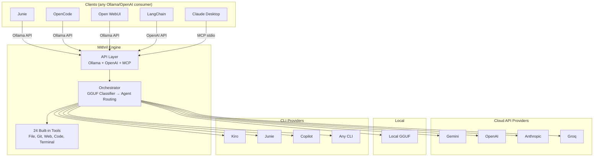

# Mithril

> *"Mithril! All folk desired it. It could be beaten like copper, and polished like glass; and the Dwarves could make of it a metal, light and yet harder than tempered steel."* — Gandalf

**A multi-model orchestration backend.** Combine any mix of LLM providers (Gemini, OpenAI, Anthropic, Groq, local GGUF) into a single Ollama-compatible API endpoint. Configure who does what in a YAML file, then point any AI tool at it.

[](https://doc.rust-lang.org/cargo/)
[](https://pypi.org/project/mithril-cli/)
[](LICENSE)
[]()

---

> **Why backend-only?** During the beta versions (pre-1.0), Mithril included a built-in terminal REPL, a full-screen TUI, and a Telegram bot. After extensive use, it became clear that tools like [Junie](https://www.jetbrains.com/junie/) and [OpenCode](https://github.com/opencode-ai/opencode) are vastly superior as coding frontends — better UX, richer tool integration, and active development by dedicated teams. Starting with v1.0, Mithril focuses exclusively on what it does best: **fellowship orchestration and multi-provider routing**. You bring the frontend you love, Mithril is the engine behind it.

---

## What It Does

You define a **fellowship** — a team of AI models working together:

```yaml
# .mithril/fellowship.yaml
name: "my-team"
controller:
  provider: local          # Free GGUF model routes requests
  model: qwen-1.5b

agents:
  - name: coder
    provider: gemini
    model: gemini-2.5-flash
    when: "coding tasks"
    tools: ["*"]

  - name: reviewer
    provider: openai
    model: gpt-4o
    when: "code review requested"
    tools: ["read_psi", "grep_files"]
```

Then you start the engine:

```bash
mithril serve
```

Now any Ollama-compatible client sees your fellowship as a model:

```bash
curl http://localhost:16180/api/tags
# → {"models": [{"name": "my-team:latest", "details": {"family": "mithril-fellowship"}}]}
```

**That's it.** Point Junie, OpenCode, Open WebUI, LangChain, or any Ollama/OpenAI client at `http://localhost:16180` and select your fellowship.

---

## Use Cases

| Use Case | How |
|----------|-----|
| **Backend for Junie** | Point Junie at `http://localhost:16180`, select your fellowship as the model |
| **Backend for OpenCode** | Same — Ollama API compatible |
| **Backend for Open WebUI** | Add as Ollama connection |
| **Backend for LangChain / LlamaIndex** | Use OpenAI API at `http://localhost:16180/v1/chat/completions` |
| **Backend for Jupyter / Python** | `pip install mithril-cli` — run directly in notebooks and data workflows |
| **MCP server for Claude Desktop** | `mithril mcp-stdio` |
| **Docker service for teams** | `docker compose up` — shared orchestration backend |

---

## Architecture



---

## Installation

### One-liner (Linux & macOS)
Downloads the universal zero-dependency static binary and automatically configures your shell `PATH`:
```bash
curl -fsSL https://raw.githubusercontent.com/GiacomoSaccaggi/mithril/main/install.sh | bash
```

### Python / Jupyter / Conda (`pip`)
Ideal for Jupyter notebooks, Google Colab, SageMaker, cloud VMs, and Python data science stacks:
```bash
pip install mithril-cli
```

### Homebrew (macOS & Linux)
```bash
brew install GiacomoSaccaggi/tap/mithril
```

### Standalone Pre-built Binaries
Download from [GitHub Releases](https://github.com/GiacomoSaccaggi/mithril/releases/latest):

| Platform | Architecture | Archive |
|---|---|---|
| **Linux** | x86_64 / amd64 | `mithril-linux-x64.tar.gz` |
| **Linux** | ARM64 / aarch64 | `mithril-linux-arm64.tar.gz` |
| **macOS** | Apple Silicon (arm64) | `mithril-macos-arm64.tar.gz` |
| **macOS** | Intel (x64) | `mithril-macos-x64.tar.gz` |
| **Windows** | x86_64 | `mithril-windows-x64.zip` |

### Docker
```bash
docker run -d -p 16180:16180 ghcr.io/giacomosaccaggi/mithril:latest
```
Or via Docker Compose:
```bash
git clone https://github.com/GiacomoSaccaggi/mithril.git
cd mithril
docker compose up -d
```

### Build from source
```bash
git clone https://github.com/GiacomoSaccaggi/mithril.git
cd mithril && cargo build --release
```

---

## Quick Start

### 1. Configure providers

```bash
# API keys — stored encrypted with Argon2id + AES-256-GCM
mithril config set gemini "AIza..."
mithril config set openai "sk-..."

# Or via environment variables (for Docker/CI):
export MITHRIL_KEY_GEMINI="AIza..."
export MITHRIL_KEY_OPENAI="sk-..."
```

### 2. Create a fellowship

```bash
mithril fellowship init
# Creates .mithril/fellowship.yaml with sensible defaults
```

### 3. Start the engine

```bash
mithril serve
# → http://localhost:16180 (Ollama + OpenAI + MCP)
```

### 4. Connect your tools

**Junie / OpenCode / Open WebUI:**
- Ollama URL: `http://localhost:16180`
- Model: select your fellowship name from the list

**LangChain / custom:**
```python
from openai import OpenAI
client = OpenAI(base_url="http://localhost:16180/v1", api_key="unused")
response = client.chat.completions.create(
    model="my-team",
    messages=[{"role": "user", "content": "Review this code"}]
)
```

---

## Credentials in Docker

Mithril reads API keys in this priority order:

1. **Environment variables** (recommended for Docker): `MITHRIL_KEY_<PROVIDER>`
2. **Encrypted config file**: `~/.mithril/config.yaml` (used by CLI)

```bash
# Docker Compose — set in .env file or environment:
MITHRIL_KEY_GEMINI=AIza...
MITHRIL_KEY_OPENAI=sk-...
MITHRIL_KEY_ANTHROPIC=sk-ant-...
MITHRIL_KEY_GROQ=gsk_...
```

No secrets are stored in the Docker image. Mount `.mithril/fellowship.yaml` for your agent configuration.

---

## Fellowship Configuration

A fellowship defines **who does what**:

```yaml
name: "code-team"
description: "Multi-model coding assistant"

controller:
  provider: local         # Routes requests (free, fast)
  model: qwen-1.5b
  context_window: 2       # Messages the router sees

agents:
  - name: worker
    provider: gemini
    model: gemini-2.5-flash
    role: "Fast coder — implements features"
    when: "any coding task"
    can_call: [reviewer]
    tools: ["*"]           # All 24 tools

  - name: reviewer
    provider: openai
    model: gpt-4o
    role: "Senior reviewer — catches bugs"
    when: "review requested or complex logic"
    can_call: []
    tools: [read_psi, grep_files, git_diff]
```

Agents communicate via the NEXT/TASK protocol:
- `NEXT: DONE` — task complete, return to user
- `NEXT: reviewer` + `TASK: check auth.rs` — delegate to another agent

---

## Provider Types

Mithril supports three types of providers:

| Type | Examples | How It Works |
|------|----------|--------------|
| **Local GGUF** | qwen-1.5b, qwen-14b, llama-8b | Direct inference via llama.cpp (free, private, fast for routing) |
| **Cloud API** | Gemini, OpenAI, Anthropic, Groq | HTTP calls to cloud LLM endpoints (pay-per-token) |
| **CLI Tools** | Kiro, Junie, Copilot, any CLI | Subprocess calls to local CLI tools that have their own model access |

```yaml
# .mithril/fellowship.yaml
name: "my-team"

controller:
  provider: local          # Local GGUF (free, used for routing)
  model: qwen-1.5b

agents:
  # Cloud API provider
  - name: coder
    provider: gemini
    model: gemini-2.5-flash

  # CLI provider (uses kiro-cli with its own auth)
  - name: reviewer
    provider: kiro
    model: claude-opus-4.6

  # GitHub Copilot CLI (2000 credits/month)
  - name: specialist
    provider: copilot
    model: gpt-5.4

  # Local GGUF (free, private, offline)
  - name: local-coder
    provider: local
    model: qwen-14b
```

CLI providers are useful when you have access to tools like Kiro, Junie, or GitHub Copilot with their own authentication and model access. Mithril orchestrates them as part of your fellowship without needing separate API keys.

> **Note on the controller:** The controller defaults to a local GGUF model which is free, fast (~100ms), and private. You can use any provider as controller, but it's not worth the cost unless precise routing justifies paying per-classification.

---

## API Endpoints

| Endpoint | Protocol | Use |
|----------|----------|-----|
| `GET /health` | — | Health check |
| `GET /api/tags` | Ollama | List models (includes fellowships) |
| `POST /api/chat` | Ollama | Chat completion |
| `POST /api/generate` | Ollama | Text generation |
| `POST /api/embed` | Ollama | Embeddings |
| `POST /api/rerank` | Ollama | Reranking |
| `POST /v1/chat/completions` | OpenAI | Chat completion |
| `GET /v1/models` | OpenAI | List models |
| `POST /mcp` | MCP | JSON-RPC tool calls |

---

## 24 Built-in Tools

File: `read_file`, `write_file`, `edit_file`, `delete_file`, `apply_patch`
Terminal: `run_terminal` (sandboxed)
Discovery: `list_files`, `grep_files`, `find_file`, `file_stats`, `glob_files`
Git: `git_status`, `git_log`, `git_diff`, `git_blame`, `git_branch`
Web: `web_search`, `fetch_page`
Code: `search_symbols`, `document_outline`
Knowledge: `lore_write`, `lore_read`
Interaction: `todo_write`, `question`

---

## Security

- **Credential encryption**: API keys are encrypted at rest with Argon2id + AES-256-GCM
- **Input redaction**: Credentials and secrets in prompts are automatically masked before being sent to cloud providers
- **Terminal sandbox**: Blocks dangerous commands (`rm -rf /`, `sudo`, `curl | bash`, etc.)
- **API token auth**: Optional bearer token for the HTTP server (`mithril config set api_token <token>`)
- **No telemetry**: Zero data collection, zero phone-home

---

## CLI Commands

| Command | Purpose |
|---------|---------|
| `mithril serve` | Start the HTTP server (Ollama + OpenAI + MCP) |
| `mithril config` | Manage API keys and settings |
| `mithril fellowship` | Create and manage fellowship configurations |
| `mithril fellowships` | List all available fellowships |
| `mithril download-model` | Download GGUF models for local inference |
| `mithril scan` | Build the Palantír semantic index for the current directory |
| `mithril mcp-stdio` | Start MCP server over stdio (for Claude Desktop) |
| `mithril init` | Analyze codebase and generate project steering file |

---

## License

MIT
