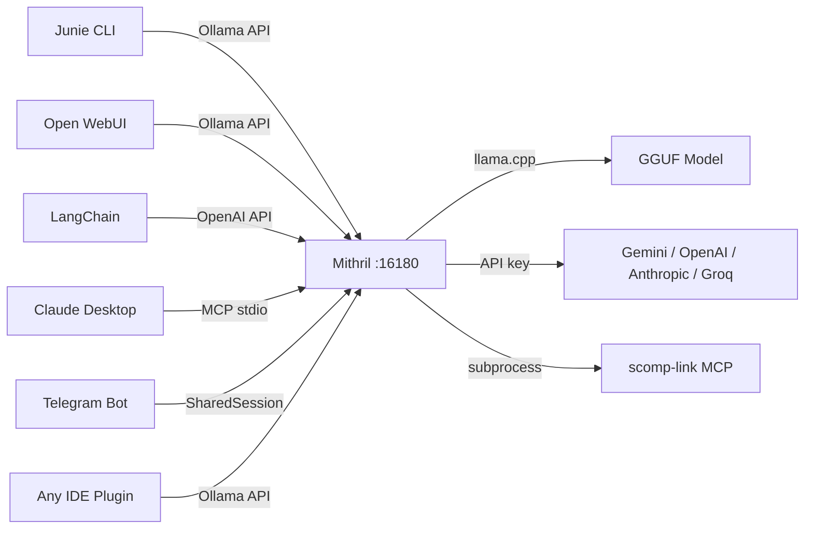
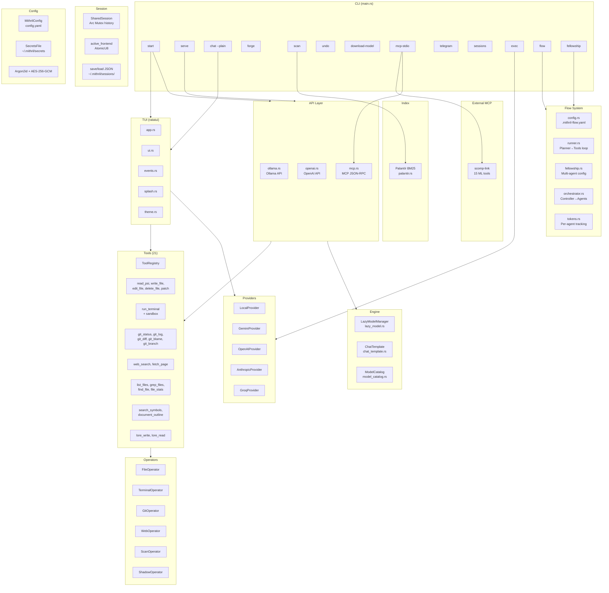
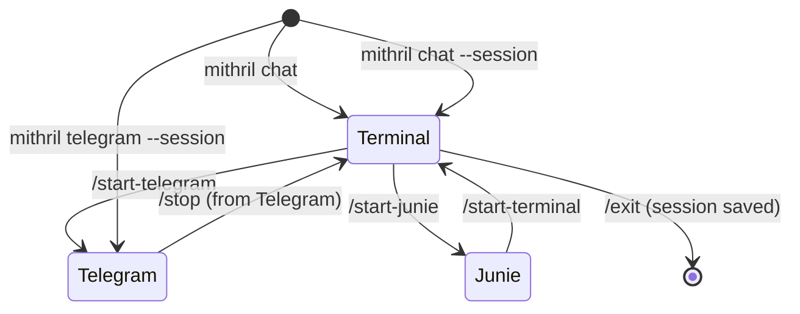
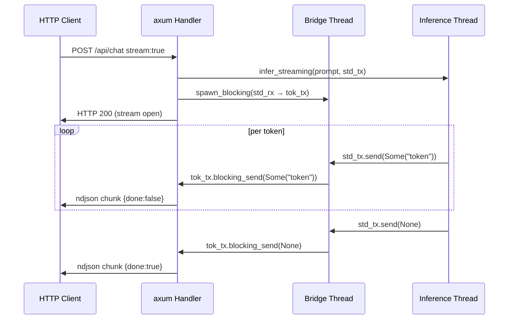

# Mithril

> *"Mithril! All folk desired it. It could be beaten like copper, and polished like glass; and the Dwarves could make of it a metal, light and yet harder than tempered steel."* — Gandalf

**Lightweight standalone LLM inference engine.** Single binary, no runtime dependencies. Serves GGUF models via Ollama-compatible API, OpenAI-compatible API, and MCP stdio — works out of the box with Junie, Open WebUI, LangChain, Claude Desktop, and any Ollama client.

[](https://doc.rust-lang.org/cargo/)
[](LICENSE)
[]()

---

## What is Mithril?

Mithril is the backend engine powering [Celebrimbot](https://github.com/GiacomoSaccaggi/Celebrimbot), the IntelliJ AI coding assistant — ported from Kotlin/JVM to a pure Rust single binary. It can also be used standalone with any Ollama-compatible client.



---

## Features

| Feature | Detail |
|---------|--------|
| **Single binary** | No JVM, no Python, no runtime required |
| **Cross-platform** | macOS, Linux, Windows |
| **TUI interface** | Full ratatui terminal UI with splash animation (default for `mithril chat`) |
| **Ollama-compatible API** | `/api/chat`, `/api/generate`, `/api/tags`, `/api/pull` |
| **OpenAI-compatible API** | `/v1/chat/completions` for LangChain, llama-index, Cursor |
| **MCP server** | JSON-RPC 2.0 over HTTP and stdio for Claude Desktop and Junie |
| **Multi-provider** | Local GGUF + Gemini, OpenAI, Anthropic, Groq in one binary |
| **Tool calling** | 21 built-in tools via MCP + 15 scomp-link ML tools = 36 total |
| **Real token streaming** | True token-by-token streaming via `mpsc` channel bridge |
| **BM25 semantic index** | Palantír index for fast project context retrieval |
| **Shadow log** | Automatic backup/undo for all file writes and deletes |
| **Shared sessions** | Persistent chat history handed off between Terminal, Telegram, Junie |
| **Telegram bot** | Continue any conversation from your phone via Telegram |
| **Lazy loading** | Model loaded on first inference, auto-unloaded after 60s idle |
| **Metal GPU** | Automatic GPU acceleration on Apple Silicon |
| **Agentic chat** | Tool calling loop in interactive chat — LLM reads, edits, verifies autonomously |
| **Flow system** | `mithril flow` — configurable Planner→Tools agentic loop via `.mithril-flow.yaml` |
| **Fellowship** | Multi-agent orchestration with GGUF controller + agent free-flow via NEXT:/TASK: protocol |
| **Start command** | `mithril start` — server + chat in one command (recommended) |
| **Headless exec** | `mithril exec` — non-interactive mode for CI/CD and scripts |
| **Steering files** | `.mithril/steering/` + `MITHRIL.md` — persistent project context |
| **Conversation compaction** | `/compact` summarizes long histories to free context window |
| **Agent Delegation** | Agents delegate to each other via NEXT:/TASK: protocol |
| **Code intelligence** | `search_symbols` + `document_outline` — structural code understanding |
| **Lore system** | `lore_write` / `lore_read` — project knowledge persistence |
| **Patch tool** | `apply_patch` — unified diff format application |
| **Argon2id credentials** | AES-256-GCM encrypted API keys with proper KDF |
| **Terminal sandbox** | Dangerous shell commands blocked before execution |
| **`mithril init`** | Auto-analyze project and generate MITHRIL.md steering file |
| **@file references** | `@path/to/file` in prompt injects file content as context |
| **Plan↔Build toggle** | Tab key switches between read-only analysis and full-access modes |
| **Permissions system** | Per-tool allow/deny/ask config in `config.yaml` |
| **Undo/Redo** | `/undo` and `/redo` revert conversation + file changes |

---

## Architecture



---

## Quick Start

```bash
# Configure at least one provider (keys stored encrypted)
mithril config set gemini "AIza..."

# Start server + chat in one command (recommended)
mithril start

# Or chat only (no server):
mithril chat                    # uses default fellowship
mithril chat my-custom-setup    # uses .mithril/fellowships/my-custom-setup.yaml

# List available fellowships:
mithril fellowships
```

---

## CLI Reference

| Command | Description |
|---------|-------------|
| `mithril start [--port 16180]` | Start server + interactive chat (recommended) |
| `mithril init` | Analyze project and generate MITHRIL.md steering file |
| `mithril serve [--port 16180]` | Start HTTP server only |
| `mithril chat [FELLOWSHIP] [--session ID] [--plain] [--no-confirm]` | Interactive chat (TUI by default, `--plain` for REPL) |
| `mithril fellowships` | List all available fellowship configurations |
| `mithril flow "message" [--config path]` | Run agentic Planner→Tools flow |
| `mithril fellowship [action]` | Multi-agent fellowship orchestration |
| `mithril exec "prompt" [--json] [--quiet]` | Run agentic task non-interactively (CI/CD) |
| `mithril forge "prompt"` | Single inference and print |
| `mithril config [list\|set\|unset\|get\|path]` | Manage credentials and settings |
| `mithril scan` | Build Palantír BM25 index for current directory |
| `mithril undo` | Undo last shadow log session |
| `mithril download-model --model qwen-1.5b` | Download a GGUF model |
| `mithril download-model --list` | List available models |
| `mithril mcp-stdio` | Start MCP server over stdin/stdout |
| `mithril telegram [--session ID]` | Start Telegram bot frontend |
| `mithril sessions list` | List all saved sessions |
| `mithril sessions show <id>` | Show full history of a session |
| `mithril sessions delete <id>` | Delete a saved session |

### Chat commands (inside `mithril chat`)

| Command | Description |
|---------|-------------|
| `/exit`, `/quit`, `/q` | Exit (session auto-saved) |
| `/clear`, `/c` | Clear conversation history |
| `/compact` | Summarize conversation to free context window |
| `/fellowship` | Show current fellowship agents and their roles |
| `/undo` | Undo last action (conversation + file changes) |
| `/redo` | Redo undone action |
| `/session` | Show session ID, fellowship, message count |
| `/history` | Show conversation history |
| `/help`, `/h` | Show command list |

---

## TUI (Terminal User Interface)

`mithril chat` opens a full ratatui-based TUI by default with:

- **Splash animation** — Dwarf mining animation on startup
- **Split-pane layout** — Input area + scrollable output
- **Non-blocking architecture** — Agent loop runs in background task, UI stays responsive
- **Status bar** — Shows `Mithril | fellowship_name | BUILD/PLAN | session_id`
- **Plan↔Build toggle** — Press **Tab** (empty input) to switch between read-only analysis and full-access modes
- **Multiline input** — **Shift+Enter** inserts a newline; **Enter** sends
- **Suggestion accept** — Press **Enter** on a suggestion to accept and send immediately
- **@file injection** — Type `@path/to/file` to inject file content into context
- **Agent traces** — Agent work shown dimmed (`┄┄` headers, `⚙` tools, `→` delegations); final response shown normal
- **Theme system** — Consistent color theming

Use `--plain` flag for the classic readline REPL (multiline with `\` at end of line):

```bash
mithril chat --plain
```

---

## Flow System

The Flow system provides configurable agentic loops via `.mithril-flow.yaml`:

```yaml
# .mithril-flow.yaml
version: "1.0"
name: "Gemini + MCP Tools"
max_iterations: 10

planner:
  name: "Gemini"
  provider: gemini
  system_prompt: |
    You are a senior software engineer assistant...
  tools:
    - read_psi
    - write_file
    - grep_files
    - find_file
    - list_files
    - run_terminal
    - git_status
    - git_diff
```

```bash
# Run a flow
mithril flow "refactor the auth module to use traits"
```

**Algorithm:** Planner → Tool Calls → Execute → Feed Results → Repeat (up to `max_iterations`)

---

## Fellowship (Multi-Agent)

The Fellowship is Mithril's multi-agent orchestration system and **the core of chat mode** — every `mithril chat` session uses a fellowship configuration with free-flow agent communication:

### Architecture

1. **GGUF Controller** — A fast, free local model (e.g. `qwen-1.5b`) classifies each user message and picks the first agent based on agent `when` descriptions
2. **Agent Free-Flow** — Agents communicate via the `NEXT:/TASK:` protocol, delegating to each other as needed
3. **GGUF as Worker** — Any agent can call `"gguf"` for trivial tasks (free local inference with tools)
4. **Rust Enforcement** — `can_call` permissions, `max_rounds`, and `token_budget` are enforced by the runtime

### NEXT:/TASK: Protocol

Agents end their responses with a protocol line that controls the flow:

| Protocol | Meaning |
|----------|---------|
| `NEXT: DONE` | Task complete — return final response to user |
| `NEXT: agent_name` | Delegate to another agent |
| `TASK: description` | (follows NEXT:) Task description for the next agent |

### Fellowship Configuration

- **Default fellowship** — `.mithril/fellowship.yaml` defines your default agent configuration
- **Named fellowships** — Additional configs in `.mithril/fellowships/*.yaml` for different workflows
- **Agent roles** — Each agent has `when` (classifier hint) and `can_call` (delegation permissions)
- **Token tracking** — Per-agent usage accounting

```yaml
# .mithril/fellowship.yaml
name: "mithril-dev"
description: "Development fellowship"

controller:
  provider: local
  model: qwen-1.5b
  context_window: 2            # Messages shown to controller for classification

max_rounds: 15                 # Maximum agent-to-agent delegations
token_budget: 50000            # Total token budget across all agents

agents:
  - name: "worker"
    provider: gemini
    model: gemini-3.6-flash
    role: "General worker"
    when: "any task"
    can_call: ["reviewer", "gguf"]
    tools: ["*"]

  - name: "reviewer"
    provider: gemini
    model: gemini-2.5-pro
    role: "Senior reviewer. EXPENSIVE."
    when: "explicit review request"
    can_call: ["worker"]
    tools: ["read_psi", "grep_files", "git_diff"]
```

### UI Display

Agent traces are shown dimmed in the TUI, with the final response shown normal:

```
┄┄ worker ┄┄┄┄┄┄┄┄┄┄┄┄┄┄┄┄┄┄┄┄┄┄┄┄┄┄┄┄
⚙ read_psi src/main.rs
⚙ edit_file src/main.rs
→ reviewer

┄┄ reviewer ┄┄┄┄┄┄┄┄┄┄┄┄┄┄┄┄┄┄┄┄┄┄┄┄┄┄
⚙ git_diff
NEXT: DONE

The refactoring looks good. I've verified...
```

```bash
mithril chat                    # uses .mithril/fellowship.yaml
mithril chat fast-groq          # uses .mithril/fellowships/fast-groq.yaml
mithril fellowships             # list all available fellowships
mithril fellowship init         # create template fellowship.yaml
mithril fellowship test         # test connectivity to each agent
```

---

## Multi-Provider Configuration

Configure API keys for each provider you want to use. The fellowship orchestrator delegates to agents based on your fellowship configuration.

```bash
# Configure API keys (stored encrypted with Argon2id + AES-256-GCM)
mithril config set gemini     "AIza..."
mithril config set openai     "sk-..."
mithril config set anthropic  "sk-ant-..."
mithril config set groq       "gsk_..."
mithril config set telegram   "<bot-token-from-BotFather>"

# Chat uses the fellowship orchestrator
mithril chat                    # uses default fellowship
mithril chat my-fellowship      # uses named fellowship

# Check which providers have credentials configured
mithril config list
```

Provider selection is defined in your fellowship configuration (`.mithril/fellowship.yaml`), not at runtime. This gives you consistent, reproducible agent setups.

---

## Groq Integration (Free Tier)

Groq provides ultra-fast LLM inference via custom LPU hardware. The free tier requires no credit card.

```bash
mithril config set groq "gsk_..."
```

Configure Groq models in your fellowship config:

```yaml
# .mithril/fellowship.yaml
agents:
  - name: "fast-coder"
    provider: groq
    model: llama-3.3-70b-versatile   # or any model below
    tools: ["*"]
```

### Available Groq Models

| Model | Speed | Free Tier Limits |
|-------|-------|------------------|
| `meta-llama/llama-4-scout-17b-16e-instruct` | ~594 TPS | 30 RPM, 1000 RPD, 30k TPM |
| `llama-3.3-70b-versatile` | ~394 TPS | 30 RPM, 1000 RPD, 12k TPM |
| `llama-3.1-8b-instant` | ~800+ TPS | 30 RPM, 14400 RPD, 6k TPM |
| `openai/gpt-oss-120b` | ~500 TPS | 30 RPM, 1000 RPD, 8k TPM |
| `openai/gpt-oss-20b` | ~1000 TPS | 30 RPM, 1000 RPD, 8k TPM |
| `qwen/qwen3-32b` | ~662 TPS | 60 RPM, 1000 RPD, 6k TPM |
| `groq/compound` | ~450 TPS | 30 RPM, 250 RPD |
| `groq/compound-mini` | ~450 TPS | 30 RPM, 250 RPD |

### Compound Mode (Server-Side Tools)

When using `groq/compound` or `groq/compound-mini`, Groq executes tools server-side:
- **Web Search** — real-time web queries with citations
- **Code Execution** — Python in sandboxed E2B environments
- **Visit Website** — fetch and analyze web pages

> **Note:** Compound mode does NOT use Mithril's built-in tools (filesystem, git, etc.). Groq handles everything server-side. To use Mithril's tools with Groq, use a standard model like `llama-3.3-70b-versatile`.

---

## Telegram Integration

```bash
# 1. Get a bot token from @BotFather on Telegram
# 2. Configure it
mithril config set telegram "<your-bot-token>"

# 3a. Transfer from an active chat session
mithril chat
> /start-telegram

# 3b. Start directly
mithril telegram

# 3c. Resume a specific session
mithril telegram --session <session-id>
```

**From Telegram:**
- Send any message → LLM responds
- `/session` → show session info
- `/stop` → return control to terminal

---

## Shared Sessions — Terminal ↔ Telegram ↔ Junie

Every `mithril chat` conversation is a **SharedSession** — a persistent JSON file with the full history. You can hand it off between frontends without losing context.



---

## Token Efficiency

Mithril has three mechanisms that reduce the number of tokens sent to the LLM on every request:

| Mechanism | Token saving | How |
|-----------|-------------|-----|
| **Palantír BM25** | 90–95% | Injects only top-N relevant files instead of whole codebase |
| **Shadow log diff** | 60–80% | Only changed lines go into context, not full files |
| **MCP tool calling** | 40–60% | LLM reads files on demand, not pre-loaded in system prompt |

See [`docs/TOKEN_EFFICIENCY.md`](docs/TOKEN_EFFICIENCY.md) for full analysis.

---

## MCP Tools (36 total)

### Mithril built-in tools (21)

| # | Tool | Description |
|---|------|-------------|
| 1 | `read_psi` | Read file content |
| 2 | `write_file` | Write file (creates or overwrites) |
| 3 | `edit_file` | Apply search/replace edits to a file |
| 4 | `delete_file` | Delete a file |
| 5 | `apply_patch` | Apply unified diff patch to a file |
| 6 | `run_terminal` | Execute shell command (sandbox protected) |
| 7 | `web_search` | DuckDuckGo search |
| 8 | `fetch_page` | Fetch and read a URL |
| 9 | `list_files` | List project files |
| 10 | `grep_files` | Regex search across files |
| 11 | `find_file` | Find file by name fragment |
| 12 | `file_stats` | File line count and size |
| 13 | `git_status` | Git working tree status |
| 14 | `git_log` | Recent commit history |
| 15 | `git_diff` | Uncommitted changes |
| 16 | `git_blame` | Per-line authorship |
| 17 | `git_branch` | Current branch name |
| 18 | `search_symbols` | Search for symbol definitions across project |
| 19 | `document_outline` | Get structural outline of a file with line numbers |
| 20 | `lore_write` | Write persistent project knowledge (key-value) |
| 21 | `lore_read` | Read stored project knowledge |

### scomp-link ML tools (15) — via `mcp.json`

| Tool | Description |
|------|-------------|
| `train_model` | Train regression/classification model |
| `predict` | Generate predictions from `.scomp` artifact |
| `validate_model` | Evaluate model with metrics + HTML report |
| `detect_drift` | Distribution drift detection |
| `detect_anomalies` | Multi-method anomaly detection |
| `check_fairness` | Fairness and bias metrics |
| `forecast_series` | Time series forecasting |
| `engineer_features` | Automated feature engineering |
| `cluster_data` | KMeans/MeanShift clustering |
| `generate_report` | Interactive HTML report (39 chart types) |
| `create_visualization` | Single chart generation |
| `compare_models` | Side-by-side model comparison |
| `export_model` | Convert to pickle/joblib/ONNX |
| `describe_data` | Dataset profiling |
| `tune_model` | Hyperparameter optimization |

---

## Streaming Architecture

Real token-by-token streaming uses a two-channel bridge to cross the `!Send` boundary of `LlamaModel`:



---

## Junie Compatibility

Mithril is fully compatible with **Junie** (JetBrains AI agent) as a local Ollama backend.

```bash
mithril serve --port 16180
```

In Junie settings → AI Model → Ollama → `http://localhost:16180` → select `qwen-1.5b`.

MCP config for tool calling (`.kiro/mcp.json`):

```json
{
  "mcpServers": {
    "mithril": {
      "command": "/path/to/mithril",
      "args": ["mcp-stdio"]
    },
    "scomp-link": {
      "command": "scomp-link",
      "args": ["mcp"]
    }
  }
}
```

See [`docs/COMPATIBILITY.md`](docs/COMPATIBILITY.md) for all integrations.

---

## API Endpoints

| Endpoint | Description | Status |
|----------|-------------|--------|
| `GET /health` | Health check + model loaded state | ✅ |
| `GET /api/tags` | List available models | ✅ |
| `GET /api/version` | Server version | ✅ |
| `GET /api/ps` | List running models | ✅ |
| `POST /api/chat` | Chat completion (Ollama format) | ✅ streaming |
| `POST /api/generate` | Text generation (Ollama format) | ✅ |
| `POST /api/show` | Model info | ✅ |
| `POST /api/pull` | Download model (async, background) | ✅ |
| `POST /v1/chat/completions` | Chat completion (OpenAI format) | ✅ |
| `GET /v1/models` | Model list (OpenAI format) | ✅ |
| `POST /mcp` | MCP JSON-RPC 2.0 | ✅ |

---

## Available Models

| ID | Description | Size |
|----|-------------|------|
| `qwen-1.5b` | Qwen 2.5 Coder 1.5B — fast, low RAM | ~1.2 GB |
| `qwen-7b` | Qwen 2.5 Coder 7B — powerful | ~4.5 GB |
| `llama-8b` | Llama 3.1 8B Instruct — all-rounder | ~5 GB |
| `deepseek-6.7b` | DeepSeek Coder 6.7B — expert coder | ~4.5 GB |
| `phi-3.5` | Phi-3.5 Mini 3.8B — lightweight | ~2.5 GB |

Models are downloaded to `~/.mithril/models/`.

---

## Security

- **Credential encryption**: Argon2id KDF + AES-256-GCM, random salt per credential, `Zeroizing<String>` in memory
- **Terminal sandbox**: Dangerous commands (`rm -rf /`, `sudo`, `dd if=`, fork bombs, etc.) blocked before execution
- **API token**: Optional bearer token for all HTTP inference and MCP endpoints
- **Secrets separation**: Sensitive fields stored in `~/.mithril/secrets` (0600 permissions), never in config.yaml

```bash
# Disable sandbox (not recommended)
mithril config set terminal_sandbox false
```

---

## Prerequisites

### macOS
```bash
brew install cmake
xcode-select --install
```

### Linux (Ubuntu/Debian)
```bash
sudo apt install build-essential cmake
```

### Windows
- [Visual Studio Build Tools](https://visualstudio.microsoft.com/downloads/) with MSVC
- [CMake](https://cmake.org/download/)

### Rust
```bash
curl --proto '=https' --tlsv1.2 -sSf https://sh.rustup.rs | sh
```

---

## Build

```bash
git clone https://github.com/GiacomoSaccaggi/mithril.git
cd mithril
cargo build --release
```

Binary: `target/release/mithril`

> First build compiles llama.cpp from source — takes 2–5 minutes.

---

## Use with Open WebUI

```bash
mithril serve &
# Point Open WebUI → Settings → Connections → Ollama → http://localhost:16180
```

## Use with any OpenAI SDK

```python
from openai import OpenAI

client = OpenAI(base_url="http://localhost:16180/v1", api_key="not-needed")
response = client.chat.completions.create(
    model="qwen-1.5b",
    messages=[{"role": "user", "content": "Hello!"}]
)
print(response.choices[0].message.content)
```

## Use with LangChain

```python
from langchain_openai import ChatOpenAI

llm = ChatOpenAI(
    base_url="http://localhost:16180/v1",
    api_key="not-needed",
    model="qwen-1.5b"
)
```

---

## Cross-Compile

```bash
cargo install cross

# Linux from macOS
cross build --release --target x86_64-unknown-linux-gnu

# Windows from macOS
cross build --release --target x86_64-pc-windows-gnu
```

---

## Documentation

| Document | Description |
|----------|-------------|
| [docs/ARCHITECTURE.md](docs/ARCHITECTURE.md) | System overview, module structure, Flow & Fellowship |
| [docs/ENGINE.md](docs/ENGINE.md) | LazyModelManager, streaming, chat templates |
| [docs/API.md](docs/API.md) | HTTP server, Ollama/OpenAI/MCP endpoints |
| [docs/PROVIDERS.md](docs/PROVIDERS.md) | Multi-provider backends + SSE streaming + tool calling |
| [docs/TOOLS.md](docs/TOOLS.md) | Tool registry and 21 built-in tools |
| [docs/OPERATORS.md](docs/OPERATORS.md) | File, terminal, git, web, shadow operators |
| [docs/INDEX.md](docs/INDEX.md) | Palantír BM25 semantic index |
| [docs/CLI.md](docs/CLI.md) | Full CLI reference (start, flow, fellowship, exec, etc.) |
| [docs/SESSION.md](docs/SESSION.md) | Shared sessions, Telegram, Junie handoff |
| [docs/COMPATIBILITY.md](docs/COMPATIBILITY.md) | Junie, Ollama clients, Claude Desktop, LangChain |
| [docs/TOKEN_EFFICIENCY.md](docs/TOKEN_EFFICIENCY.md) | How Mithril reduces token usage |
| [docs/SECURITY.md](docs/SECURITY.md) | Security mechanisms, API token, sandbox |
| [CONTRIBUTING.md](CONTRIBUTING.md) | How to add providers, tools, models |

---

## License

MIT
