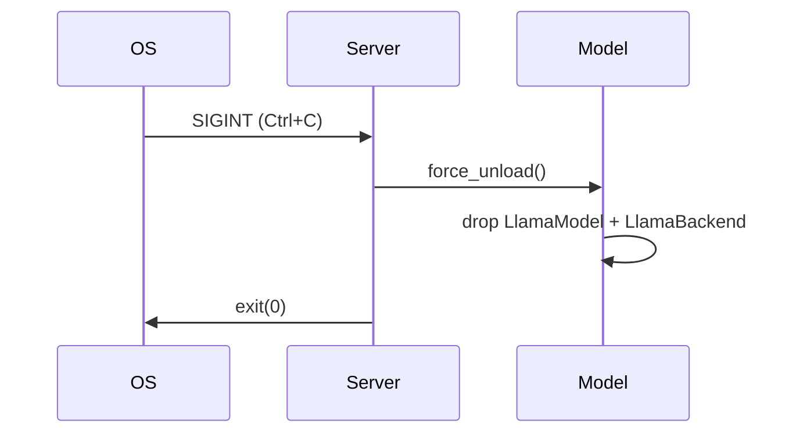
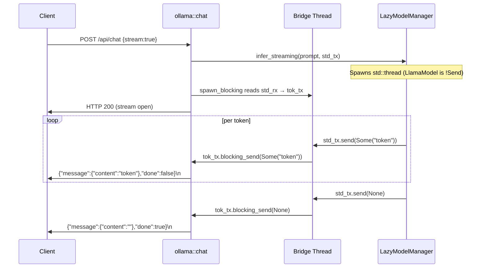
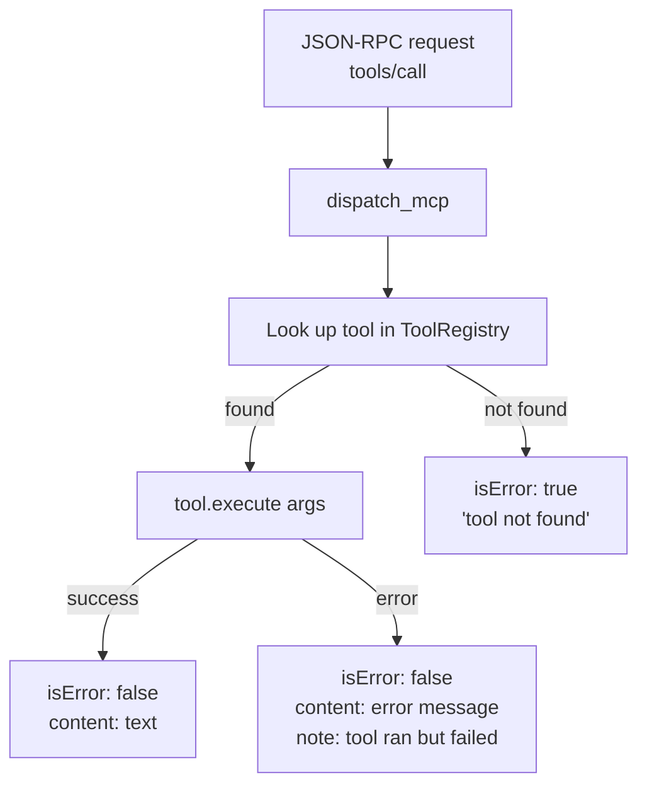

# API Module

The API module provides HTTP endpoints compatible with Ollama, OpenAI, and MCP protocols.

**Location**: `src/api/`

## Files

| File | Purpose |
|------|---------|
| `server.rs` | Axum HTTP server, `AppState`, graceful shutdown |
| `ollama.rs` | Ollama-compatible API endpoints |
| `openai.rs` | OpenAI-compatible API endpoints |
| `mcp.rs` | Model Context Protocol (JSON-RPC 2.0) |
| `mod.rs` | Module exports |

---

## server.rs — HTTP Server

### Struct: `AppState`

Shared application state passed to all handlers via Axum's `State` extractor.

```rust
#[derive(Clone)]
pub struct AppState {
    pub model_manager: Arc<LazyModelManager>,
    pub tool_registry: Arc<ToolRegistry>,
    pub file_operator: Arc<FileOperator>,
    pub scan_operator: Arc<ScanOperator>,
    pub project_path: String,
    /// Tracks active model downloads: model_id → status ("pulling" | "success" | "error")
    pub active_downloads: Arc<Mutex<HashMap<String, String>>>,
}
```

### Route table

| Method | Path | Handler | API |
|--------|------|---------|-----|
| GET | `/health` | `health()` | Health check |
| GET | `/api/tags` | `ollama::list_models` | Ollama |
| GET | `/api/version` | `ollama::version` | Ollama |
| GET | `/api/ps` | `ollama::running_models` | Ollama |
| POST | `/api/generate` | `ollama::generate` | Ollama |
| POST | `/api/chat` | `ollama::chat` | Ollama |
| POST | `/api/show` | `ollama::show_model` | Ollama |
| POST | `/api/pull` | `ollama::pull_model` | Ollama |
| POST | `/api/embed` | `ollama::embed` | Ollama |
| POST | `/v1/chat/completions` | `openai::chat_completions` | OpenAI |
| GET | `/v1/models` | `openai::list_models` | OpenAI |
| POST | `/mcp` | `mcp::handle_mcp` | MCP |

### Graceful shutdown

The server intercepts `Ctrl+C` (SIGINT) via `tokio::signal::ctrl_c()` and calls `model_manager.force_unload()` before exiting. This ensures the GGUF model is cleanly released from GPU memory.



---

## Endpoint: `GET /health`

Returns server status and model state.

**Response:**
```json
{
  "status": "ok",
  "model_loaded": false,
  "version": "0.1.0"
}
```

---

## ollama.rs — Ollama API

### Endpoint: `POST /api/chat`

**Streaming flow:**



**Request:**
```json
{
  "model": "qwen-1.5b",
  "messages": [
    { "role": "system", "content": "You are helpful." },
    { "role": "user", "content": "Hello!" }
  ],
  "stream": true,
  "options": { "temperature": 0.7, "num_predict": 2048 }
}
```

**Streaming response (NDJSON, one line per token):**
```
{"model":"qwen-1.5b","created_at":"...","message":{"role":"assistant","content":"Hello"},"done":false}
{"model":"qwen-1.5b","created_at":"...","message":{"role":"assistant","content":"!"},"done":false}
{"model":"qwen-1.5b","created_at":"...","message":{"role":"assistant","content":""},"done":true}
```

**Non-streaming response:**
```json
{
  "model": "qwen-1.5b",
  "created_at": "2024-01-01T00:00:00Z",
  "message": { "role": "assistant", "content": "Hello! How can I help?" },
  "done": true
}
```

**Error responses:**

| Condition | HTTP status | Body |
|-----------|-------------|------|
| Model not in catalog | 404 | `{"error":"model not found: xyz"}` |
| Inference failure | 500 | `{"error":"..."}` |
| Malformed JSON | 422 | Axum default |

---

### Endpoint: `POST /api/pull`

Downloads a model in the background. Returns immediately with status `pulling manifest`.

**Request:**
```json
{ "model": "qwen-7b" }
```

**Responses:**

```json
{ "status": "pulling manifest", "model": "qwen-7b" }
```

```json
{ "status": "already pulling", "model": "qwen-7b" }
```

The download runs via `tokio::spawn` delegating to `cli::download::run()`. Progress is tracked in `AppState.active_downloads`:

```rust
pub active_downloads: Arc<Mutex<HashMap<String, String>>>
// "qwen-7b" → "pulling" | "success" | "error"
```

---

### Endpoint: `POST /api/embed`

**Embeddings are not supported** in this build. Returns `501 Not Implemented`.

```json
HTTP 501
{ "error": "embeddings are not supported in this build of Mithril" }
```

> This is intentional: returning an empty array silently (as before) would cause clients to silently misbehave. A 501 error forces the client to handle the unsupported case.

---

## openai.rs — OpenAI API

### Endpoint: `POST /v1/chat/completions`

**Request:**
```json
{
  "model": "qwen-1.5b",
  "messages": [{ "role": "user", "content": "Hello!" }],
  "temperature": 0.7,
  "max_tokens": 2048
}
```

**Response:**
```json
{
  "id": "chatcmpl-<uuid>",
  "object": "chat.completion",
  "created": 1234567890,
  "model": "qwen-1.5b",
  "choices": [{
    "index": 0,
    "message": { "role": "assistant", "content": "Hello!" },
    "finish_reason": "stop"
  }],
  "usage": { "prompt_tokens": 0, "completion_tokens": 0, "total_tokens": 0 }
}
```

> Token counts are not tracked (always 0). This is a known limitation.

**Model fallback:** If the requested model is not in the catalog, the first model (`qwen-1.5b`) is used as a fallback instead of returning 404. This improves compatibility with clients that send arbitrary model names.

---

## mcp.rs — Model Context Protocol

Implements [MCP JSON-RPC 2.0](https://spec.modelcontextprotocol.io/) (protocol version `2024-11-05`).

### Supported methods

| Method | Description |
|--------|-------------|
| `initialize` | Handshake, returns capabilities |
| `notifications/initialized` | Acknowledgment (no response) |
| `tools/list` | Returns all 21 tool definitions |
| `tools/call` | Executes a tool |
| `resources/list` | Lists project files |
| `resources/read` | Reads a file |

### `tools/call` flow



### `initialize` response

```json
{
  "jsonrpc": "2.0",
  "id": 1,
  "result": {
    "protocolVersion": "2024-11-05",
    "capabilities": { "tools": {}, "resources": {} },
    "serverInfo": { "name": "mithril", "version": "0.1.0" }
  }
}
```

### `tools/call` request and response

**Request:**
```json
{
  "jsonrpc": "2.0",
  "id": 3,
  "method": "tools/call",
  "params": {
    "name": "read_psi",
    "arguments": { "target": "src/main.rs" }
  }
}
```

**Success response:**
```json
{
  "jsonrpc": "2.0",
  "id": 3,
  "result": {
    "content": [{ "type": "text", "text": "fn main() { ... }" }],
    "isError": false
  }
}
```

**Error response (tool not found):**
```json
{
  "jsonrpc": "2.0",
  "id": 3,
  "result": {
    "content": [{ "type": "text", "text": "Error: unknown tool: xyz" }],
    "isError": true
  }
}
```

### Dual transport

The same `dispatch_mcp()` function handles both HTTP (`/mcp`) and stdio (`mithril mcp-stdio`):

```rust
// HTTP handler
pub async fn handle_mcp(State(state): State<AppState>, body: String) -> String {
    dispatch_mcp(&body, &state.tool_registry, ...)
}

// Stdio handler (mcp_stdio.rs)
for line in stdin.lines() {
    let response = dispatch_mcp(&line?, &registry, ...);
    println!("{response}");
}
```
