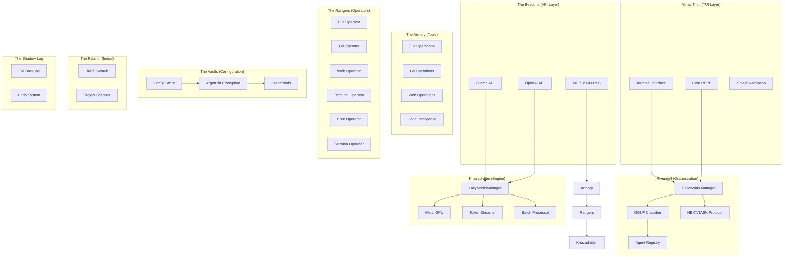
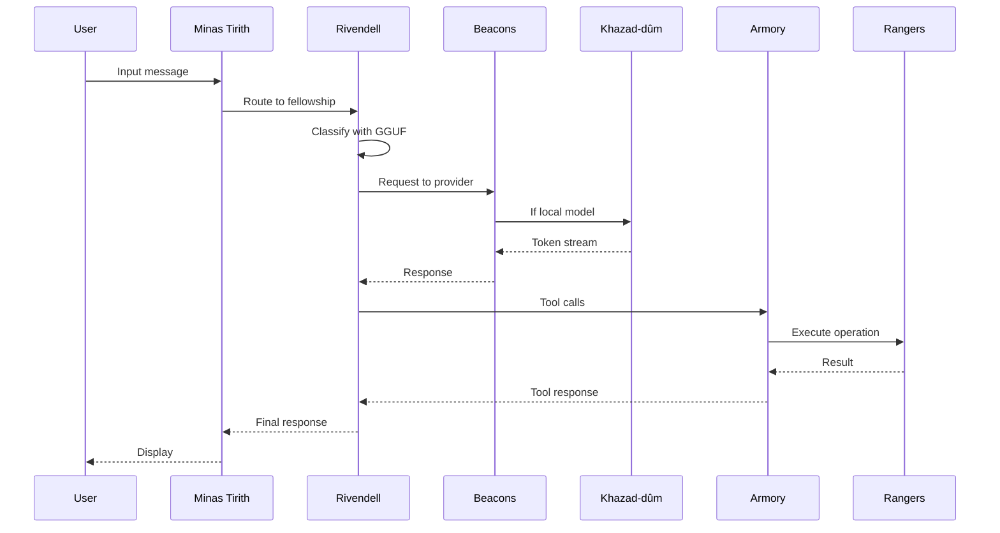

# The Realms of Mithril

> *"The world is changed. I feel it in the water. I feel it in the earth. I smell it in the air."* — Galadriel

This document maps the architecture of Mithril to the great realms of Middle-earth. Each realm serves a distinct purpose in the forging of this inference engine.

---

## The Map of Middle-earth



---

## Khazad-dûm — The Engine

> *"Dwarf doors are invisible when closed."*

The deepest realm of Mithril, where the true forging occurs. Khazad-dûm houses the inference engine built on llama.cpp bindings.

### Components

| Component | Purpose |
|-----------|---------|
| **LazyModelManager** | Loads models on first inference, unloads after idle timeout |
| **Token Streamer** | True token-by-token streaming via `mpsc` channels |
| **Metal GPU** | Automatic Apple Silicon acceleration |
| **Batch Processor** | Handles concurrent inference requests |

### Architecture

```rust
// The heart of Khazad-dûm
pub struct LazyModelManager {
    model: Option<LlamaModel>,
    config: ModelConfig,
    last_used: Instant,
    idle_timeout: Duration,
}
```

The engine follows these principles:
1. **Lazy Loading** — Models occupy no memory until needed
2. **Auto-Unload** — Idle models are released after configurable timeout
3. **Metal First** — GPU acceleration is automatic on Apple Silicon
4. **Stream Native** — Tokens flow through channels, not buffers

---

## Rivendell — The Orchestration Layer

> *"The road must be trod, but it will be very hard. And neither strength nor wisdom will carry us far upon it."*

Rivendell is where the Council gathers — the orchestration layer that coordinates multiple agents working toward a common goal.

### The Fellowship System

Every chat session may invoke a Fellowship, defined in `.mithril/fellowship.yaml`:

```yaml
name: "fellowship-of-code"
controller:
  provider: local
  model: qwen-1.5b
  
agents:
  - name: "worker"
    provider: gemini
    model: gemini-2.5-flash
    tools: ["*"]
```

### The NEXT/TASK Protocol

Agents communicate through a simple but powerful protocol:

| Signal | Meaning |
|--------|---------|
| `NEXT: DONE` | Task complete, return to user |
| `NEXT: worker` | Hand off to the worker agent |
| `TASK: implement X` | Describe the work to be done |

### The GGUF Classifier

A small local model (typically 1-2B parameters) acts as a router, determining which agent should handle each request based on:
- Message content analysis
- Agent capability matching
- Current task context

### Agent Types

| Type | Definition | Example |
|------|------------|---------|
| **YAML Agent** | Defined in `fellowship.yaml` | Worker, Reviewer |
| **Markdown Agent** | Natural language in `.mithril/agents/*.md` | Loremaster |
| **@Mentioned** | Directly addressed via `@name` | `@reviewer check this` |

---

## Minas Tirith — The TUI Layer

> *"The beacons of Minas Tirith! The beacons are lit!"*

The White City stands as the interface between the user and the realms below. Built with `ratatui`, it provides a full terminal experience.

### Components

| Component | Purpose |
|-----------|---------|
| **Splash Screen** | Animated welcome with Mithril branding |
| **Chat View** | Streaming message display with markdown rendering |
| **Status Bar** | Current model, token count, mode indicator |
| **Input Area** | Multi-line editing with history |

### Modes

| Mode | Key | Behavior |
|------|-----|----------|
| **Plan** | `Tab` | Read-only analysis, no file modifications |
| **Build** | `Tab` | Full tool access including writes |

### Plain REPL

For simpler needs, `mithril chat --plain` provides a readline-based interface without the full TUI.

---

## The Beacons — API Layer

> *"Hope is kindled."*

The Beacons of Gondor carry signals across the realm. In Mithril, they expose three API dialects:

### Ollama API (`/api/*`)

Full compatibility with Ollama clients:

| Endpoint | Purpose |
|----------|---------|
| `GET /api/tags` | List available models |
| `POST /api/chat` | Chat completion with streaming |
| `POST /api/generate` | Text generation |

### OpenAI API (`/v1/*`)

For OpenAI SDK compatibility:

| Endpoint | Purpose |
|----------|---------|
| `GET /v1/models` | List models |
| `POST /v1/chat/completions` | Chat completion |

### MCP JSON-RPC (`/mcp`)

Model Context Protocol for tool-using agents:

| Method | Purpose |
|--------|---------|
| `tools/list` | Enumerate available tools |
| `tools/call` | Execute a tool |

---

## The Armory — Tools Layer

> *"My armour is like tenfold shields, my teeth are swords, my claws spears."*

Twenty-four tools stand ready in the Armory, organized by domain:

### Categories

| Category | Tools |
|----------|-------|
| **File** | `read_file`, `write_file`, `edit_file`, `delete_file`, `apply_patch` |
| **Discovery** | `list_files`, `grep_files`, `find_file`, `file_stats` |
| **Git** | `git_status`, `git_log`, `git_diff`, `git_blame`, `git_branch`, `git_commit` |
| **Terminal** | `run_terminal` |
| **Web** | `web_search`, `fetch_page` |
| **Code** | `search_symbols`, `document_outline` |
| **Lore** | `lore_write`, `lore_read` |
| **Session** | `share_session` |

---

## The Rangers — Operators Layer

> *"All that is gold does not glitter, not all those who wander are lost."*

The Rangers patrol the boundaries between tools and the outside world, providing security and abstraction.

### The Six Rangers

| Ranger | Domain | Responsibilities |
|--------|--------|------------------|
| **File Operator** | Filesystem | Path validation, shadow log, read/write |
| **Git Operator** | Version control | Safe git operations, diff generation |
| **Web Operator** | Network | URL fetching, search queries |
| **Terminal Operator** | Shell | Command execution, sanctuary enforcement |
| **Lore Operator** | Knowledge | Project lore read/write |
| **Session Operator** | State | Session sharing and persistence |

---

## The Vaults — Configuration Layer

> *"Keep it secret. Keep it safe."*

The Vaults of Mithril store sensitive configuration with proper cryptographic protection.

### Encryption Stack

| Layer | Technology |
|-------|------------|
| **KDF** | Argon2id |
| **Cipher** | AES-256-GCM |
| **Storage** | `~/.mithril/credentials.enc` |

### Configuration Hierarchy

1. **System defaults** — Compiled into binary
2. **User config** — `~/.mithril/config.yaml`
3. **Project config** — `.mithril/config.yaml`
4. **Environment** — `MITHRIL_*` variables
5. **CLI flags** — Highest priority

---

## The Palantír — Index Layer

> *"The Palantíri came from beyond Westernesse, from Eldamar."*

The Palantír provides far-seeing into your codebase through BM25 semantic search.

### Components

| Component | Purpose |
|-----------|---------|
| **Scanner** | Traverses project files |
| **Tokenizer** | Splits content for indexing |
| **BM25 Index** | Ranked retrieval |
| **Cache** | Persistent index storage |

### Usage

```bash
mithril scan              # Build the index
mithril chat              # Queries use the index automatically
```

---

## The Shadow Log — Undo System

> *"The Shadow that bred them can only mock, it cannot make."*

Every file modification is backed up to the Shadow Log, enabling full undo:

```bash
mithril undo              # Restore last session's changes
mithril undo --list       # Show available restore points
```

### Structure

```
~/.mithril/shadow/
├── 2024-01-15T10:30:00/
│   ├── manifest.json
│   └── files/
│       ├── src_main.rs
│       └── Cargo.toml
```

---

## Data Flow



---

> *"I will not say: do not weep; for not all tears are an evil."*
