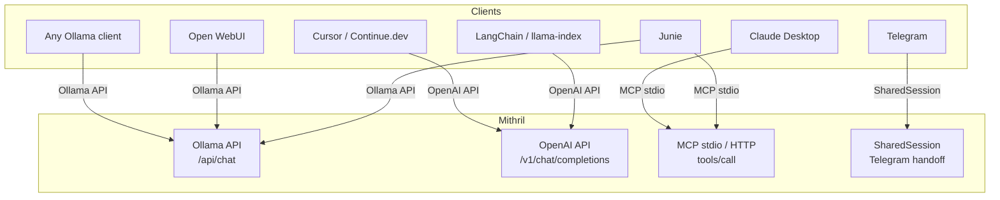
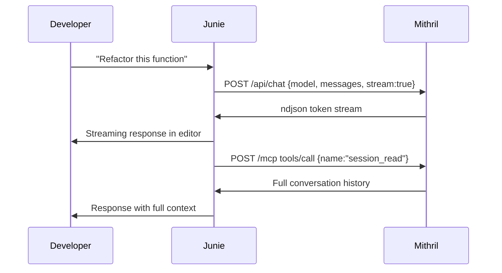

# Compatibility Guide

Mithril exposes three interfaces simultaneously: **Ollama API**, **OpenAI API**, and **MCP**. This page shows how to connect every major client.



---

## Junie (JetBrains AI Agent)

Mithril provides both the **LLM backend** and the **tool server** for Junie.

### Step 1 — Start Mithril

```bash
mithril download-model --model qwen-1.5b
mithril serve --port 16180
```

### Step 2 — Configure as Ollama backend

In IntelliJ IDEA / any JetBrains IDE:

1. Settings → Tools → AI Assistant → Local Models
2. Provider: **Ollama** → URL: `http://localhost:16180`
3. Model: `qwen-1.5b`

### Step 3 — MCP config with scomp-link

Create `.kiro/mcp.json` in the project root:

```json
{
  "mcpServers": {
    "mithril": {
      "command": "/path/to/mithril",
      "args": ["mcp-stdio"],
      "env": {}
    },
    "scomp-link": {
      "command": "scomp-link",
      "args": ["mcp"],
      "env": {}
    }
  }
}
```

This gives Junie access to **36 tools**: 21 Mithril (file/git/terminal/web/code/lore/patch) + 15 scomp-link (ML/analytics).

### Step 4 — Share session context with Junie

```bash
mithril chat
> I've been debugging auth.rs — the token validation is broken
> /start-junie
  🤖 Session shared with Junie via MCP.
```

Junie calls `session_read` and sees your full conversation context without you repeating it.



---

## Telegram

Continue any conversation from your phone.

```bash
# 1. Get a bot token from @BotFather
# 2. Configure
mithril config set telegram "<token>"

# 3. Start from a chat session
mithril chat
> /start-telegram

# Or start directly
mithril telegram
mithril telegram --session <id>
```

**From Telegram:** send any message → LLM responds. `/stop` returns to terminal.

See [SESSION.md](SESSION.md) for the full handoff flow.

---

## Open WebUI

```bash
# Start Mithril
mithril serve --port 16180

# Docker
docker run -d -p 3000:8080 \
  -e OLLAMA_BASE_URL=http://host.docker.internal:16180 \
  ghcr.io/open-webui/open-webui:main
```

Open `http://localhost:3000` → Settings → Connections → Ollama → `http://host.docker.internal:16180`.

> On Linux replace `host.docker.internal` with `172.17.0.1`.

---

## Claude Desktop

`~/Library/Application Support/Claude/claude_desktop_config.json`:

```json
{
  "mcpServers": {
    "mithril": {
      "command": "/Users/<you>/.cargo/bin/mithril",
      "args": ["mcp-stdio"]
    },
    "scomp-link": {
      "command": "scomp-link",
      "args": ["mcp"]
    }
  }
}
```

Restart Claude Desktop. 36 tools appear in Claude's tool panel.

---

## LangChain

```python
from langchain_openai import ChatOpenAI

llm = ChatOpenAI(
    base_url="http://localhost:16180/v1",
    api_key="not-needed",
    model="qwen-1.5b",
    streaming=True,
)

for chunk in llm.stream([HumanMessage(content="Explain Rust lifetimes")]):
    print(chunk.content, end="", flush=True)
```

---

## llama-index

```python
from llama_index.llms.openai import OpenAI

llm = OpenAI(
    api_base="http://localhost:16180/v1",
    api_key="not-needed",
    model="qwen-1.5b",
)
```

---

## Cursor / Continue.dev

### Cursor — `.cursor/settings.json`

```json
{
  "openai.apiBase": "http://localhost:16180/v1",
  "openai.apiKey": "not-needed",
  "openai.model": "qwen-1.5b"
}
```

### Continue.dev — `.continue/config.json`

```json
{
  "models": [{
    "title": "Mithril (local)",
    "provider": "openai",
    "model": "qwen-1.5b",
    "apiBase": "http://localhost:16180/v1",
    "apiKey": "not-needed"
  }]
}
```

---

## Any Ollama client

Change the base URL from `http://localhost:11434` to `http://localhost:16180`.

```bash
export OLLAMA_HOST=http://localhost:16180
ollama list
ollama run qwen-1.5b "What is Rust?"
```

### Tested compatible clients

| Client | Notes |
|--------|-------|
| Ollama CLI | `OLLAMA_HOST=http://localhost:16180 ollama run qwen-1.5b` |
| Open WebUI | See above |
| Msty | Settings → Local AI → Custom URL |
| Chatbox | Settings → Ollama → URL |
| Jan | Settings → Local API Server |
| Aider | `--openai-api-base http://localhost:16180/v1` |
| Shell GPT | `--api-base http://localhost:16180/v1` |

---

## scomp-link Integration

scomp-link is a Python ML toolkit with 15 MCP tools. Mithril ships with a ready-made `mcp.json` that includes it.

### Install

```bash
pip install "scomp-link[mcp]"
```

### `mcp.json` (project root)

```json
{
  "mcpServers": {
    "mithril": {
      "command": "/path/to/mithril",
      "args": ["mcp-stdio"]
    },
    "scomp-link": {
      "command": "scomp-link",
      "args": ["mcp"]
    }
  }
}
```

**scomp-link tools available via MCP:**

| Tool | Description |
|------|-------------|
| `train_model` | Train regression/classification |
| `predict` | Predict from `.scomp` artifact |
| `validate_model` | Evaluate + HTML report |
| `detect_drift` | Distribution drift |
| `detect_anomalies` | Multi-method anomaly detection |
| `check_fairness` | Fairness and bias metrics |
| `forecast_series` | Time series forecasting |
| `engineer_features` | Automated feature engineering |
| `cluster_data` | KMeans/MeanShift |
| `generate_report` | Interactive HTML (39 chart types) |
| `create_visualization` | Single chart |
| `compare_models` | Side-by-side comparison |
| `export_model` | pickle/joblib/ONNX |
| `describe_data` | Dataset profiling |
| `tune_model` | Hyperparameter optimization |

---

## Compatibility Matrix

| Client | Ollama API | OpenAI API | MCP stdio | MCP HTTP | Streaming | Sessions |
|--------|-----------|-----------|----------|---------|-----------|---------|
| Junie | ✅ | ✅ | ✅ | ✅ | ✅ | ✅ |
| Telegram | — | — | — | — | — | ✅ |
| Open WebUI | ✅ | — | — | — | ✅ | — |
| Claude Desktop | — | — | ✅ | — | — | — |
| LangChain | — | ✅ | — | — | ✅ | — |
| llama-index | — | ✅ | — | — | ✅ | — |
| Cursor | — | ✅ | — | — | ✅ | — |
| Continue.dev | — | ✅ | — | — | ✅ | — |
| Aider | — | ✅ | — | — | ✅ | — |
| Ollama CLI | ✅ | — | — | — | ✅ | — |
| Shell GPT | — | ✅ | — | — | ✅ | — |
