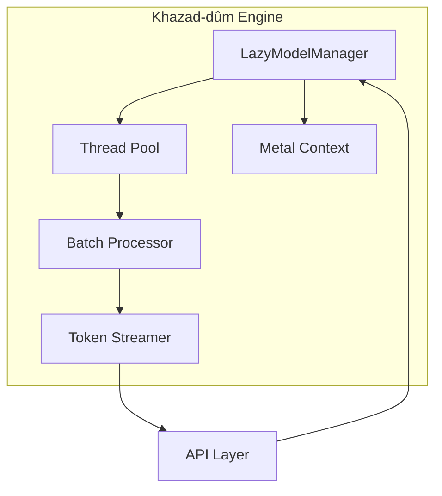

# Khazad-dûm — The Engine

> *"Moria! Moria! Wonder of the Northern world!"* — Gandalf

Deep beneath the surface lies Khazad-dûm, the inference engine that powers Mithril. Built on llama.cpp with Rust bindings, it provides local model execution with GPU acceleration.

---

## Architecture Overview



---

## LazyModelManager

> *"Dwarf doors are invisible when closed."*

The LazyModelManager ensures models occupy memory only when needed.

### Lifecycle

```
Idle → First Request → Load Model → Inference → Keep-alive → Idle Timeout → Unload
                                        ↑                          |
                                        └──────────────────────────┘
```

### Implementation

```rust
pub struct LazyModelManager {
    /// Currently loaded model (None if idle)
    model: Option<LlamaModel>,
    
    /// Model configuration
    config: ModelConfig,
    
    /// Last inference timestamp
    last_used: Instant,
    
    /// Idle timeout before unload
    idle_timeout: Duration,
    
    /// Loading lock for thread safety
    loading: Mutex<bool>,
}

impl LazyModelManager {
    pub async fn infer(&self, request: InferRequest) -> Result<InferResponse> {
        // Ensure model is loaded
        self.ensure_loaded().await?;
        
        // Update last used timestamp
        self.last_used = Instant::now();
        
        // Perform inference
        self.model.as_ref().unwrap().infer(request).await
    }
    
    async fn ensure_loaded(&self) -> Result<()> {
        if self.model.is_some() {
            return Ok(());
        }
        
        let _guard = self.loading.lock().await;
        
        // Double-check after acquiring lock
        if self.model.is_some() {
            return Ok(());
        }
        
        // Load the model
        self.model = Some(self.load_model().await?);
        Ok(())
    }
    
    pub async fn check_idle(&self) {
        if self.last_used.elapsed() > self.idle_timeout {
            self.unload().await;
        }
    }
}
```

### Configuration

```yaml
# ~/.mithril/config.yaml
engine:
  # Seconds before unloading idle model
  idle_timeout: 300
  
  # Check interval for idle timeout
  idle_check_interval: 30
  
  # Preload model on startup (disables lazy loading)
  preload: false
```

### Memory Profile

| State | Memory Usage |
|-------|--------------|
| Idle | ~50 MB (runtime only) |
| Loading 7B model | ~4-8 GB (varies by quantization) |
| Inference | +0.5-2 GB (context cache) |
| Post-unload | ~50 MB (back to idle) |

---

## Token Streaming

> *"The Road goes ever on and on."*

Mithril provides true token-by-token streaming through an `mpsc` channel bridge.

### Stream Architecture

```
llama.cpp callback → Channel Sender → Channel Receiver → HTTP/SSE
         ↓                                    ↓
    Token generated                   Sent to client
```

### Implementation

```rust
pub struct TokenStream {
    receiver: mpsc::Receiver<StreamEvent>,
}

enum StreamEvent {
    Token(String),
    Done,
    Error(String),
}

impl LazyModelManager {
    pub fn stream_infer(&self, request: InferRequest) -> TokenStream {
        let (tx, rx) = mpsc::channel(100);
        
        // Spawn inference task
        tokio::spawn(async move {
            let callback = |token: &str| {
                let _ = tx.blocking_send(StreamEvent::Token(token.to_string()));
            };
            
            match self.infer_with_callback(request, callback).await {
                Ok(_) => { let _ = tx.send(StreamEvent::Done).await; }
                Err(e) => { let _ = tx.send(StreamEvent::Error(e.to_string())).await; }
            }
        });
        
        TokenStream { receiver: rx }
    }
}
```

### HTTP Integration

Streaming maps to Server-Sent Events:

```rust
async fn stream_handler(stream: TokenStream) -> impl IntoResponse {
    let event_stream = stream.receiver.map(|event| {
        match event {
            StreamEvent::Token(t) => {
                Event::default()
                    .event("token")
                    .data(json!({"content": t}).to_string())
            }
            StreamEvent::Done => {
                Event::default()
                    .event("done")
                    .data("{}")
            }
            StreamEvent::Error(e) => {
                Event::default()
                    .event("error")
                    .data(json!({"error": e}).to_string())
            }
        }
    });
    
    Sse::new(event_stream)
}
```

### Client Consumption

```javascript
const eventSource = new EventSource('/api/chat');

eventSource.onmessage = (event) => {
    const data = JSON.parse(event.data);
    appendToChat(data.content);
};

eventSource.addEventListener('done', () => {
    eventSource.close();
});
```

---

## Metal GPU Acceleration

> *"Mithril! It was worth more than gold."*

On Apple Silicon, Metal acceleration is automatic and significantly improves performance.

### Detection

```rust
fn detect_metal() -> bool {
    #[cfg(target_os = "macos")]
    {
        // Check for Metal-capable GPU
        if let Ok(device) = metal::Device::system_default() {
            return true;
        }
    }
    false
}
```

### Configuration

```yaml
engine:
  # GPU layers (-1 = all on GPU, 0 = CPU only)
  gpu_layers: -1
  
  # Metal-specific settings
  metal:
    # Use unified memory (recommended for M-series)
    use_mmap: true
    
    # Memory locked (prevents swapping)
    use_mlock: false
```

### Layer Distribution

| Setting | Behavior |
|---------|----------|
| `gpu_layers: -1` | All layers on GPU (recommended) |
| `gpu_layers: 0` | CPU only |
| `gpu_layers: 20` | First 20 layers on GPU |

### Performance Comparison (M2 Pro)

| Model | CPU Only | Metal GPU |
|-------|----------|-----------|
| 7B Q4 | ~8 tok/s | ~45 tok/s |
| 13B Q4 | ~4 tok/s | ~25 tok/s |
| 34B Q4 | OOM | ~12 tok/s |

### Monitoring GPU Usage

```bash
# While Mithril is running:
sudo powermetrics --samplers gpu_power -i 1000
```

---

## Batch Processing

> *"There is only one way to cross the water."*

The batch processor handles prompt encoding efficiently.

### Prompt Batching

```rust
pub struct BatchProcessor {
    /// Maximum batch size
    max_batch_size: usize,
    
    /// Current batch
    batch: Vec<Token>,
}

impl BatchProcessor {
    pub fn process_prompt(&mut self, prompt: &str) -> Result<Vec<Token>> {
        let tokens = self.tokenize(prompt)?;
        
        // Process in batches for efficiency
        for chunk in tokens.chunks(self.max_batch_size) {
            self.process_batch(chunk)?;
        }
        
        Ok(tokens)
    }
}
```

### Configuration

```yaml
engine:
  # Batch size for prompt processing
  batch_size: 512
  
  # Maximum concurrent batches
  max_concurrent_batches: 2
```

### Memory Efficiency

Batching reduces memory allocation overhead:

| Prompt Size | Without Batching | With Batching |
|-------------|-----------------|---------------|
| 1K tokens | 1 alloc/token | 2 allocs total |
| 10K tokens | 10K allocs | 20 allocs total |
| 100K tokens | 100K allocs | 200 allocs total |

---

## Thread Pool

> *"Many hands make light work."*

The engine maintains a thread pool for parallel operations.

### Pool Configuration

```yaml
engine:
  # Thread count (0 = auto-detect)
  threads: 0
  
  # Pin threads to CPU cores
  pin_threads: true
```

### Auto-Detection

```rust
fn detect_thread_count() -> usize {
    // Use physical cores, not hyperthreads
    num_cpus::get_physical()
}
```

### Thread Assignment

| Operation | Threads Used |
|-----------|--------------|
| Tokenization | 1 |
| Prompt encoding | All |
| Token generation | All |
| Sampling | 1 |

---

## Context Management

> *"I am looking for someone to share in an adventure."*

Efficient context (KV cache) management enables long conversations.

### Context Structure

```rust
pub struct ContextCache {
    /// Key-value cache for transformer layers
    kv_cache: Vec<LayerCache>,
    
    /// Current context length
    length: usize,
    
    /// Maximum context length
    max_length: usize,
}
```

### Context Operations

| Operation | Description |
|-----------|-------------|
| Append | Add new tokens to context |
| Truncate | Remove oldest tokens (FIFO) |
| Clear | Reset context for new conversation |
| Save | Serialize for session persistence |

### Memory Usage

| Context Length | 7B Model | 13B Model |
|----------------|----------|-----------|
| 2K tokens | ~0.5 GB | ~1 GB |
| 4K tokens | ~1 GB | ~2 GB |
| 8K tokens | ~2 GB | ~4 GB |

---

## Sampling Configuration

> *"Even the smallest person can change the course of the future."*

Control how tokens are selected during generation.

### Parameters

```yaml
engine:
  sampling:
    # Temperature (higher = more random)
    temperature: 0.7
    
    # Top-p nucleus sampling
    top_p: 0.9
    
    # Top-k sampling
    top_k: 40
    
    # Repetition penalty
    repeat_penalty: 1.1
    
    # Tokens to consider for repetition
    repeat_last_n: 64
```

### Per-Request Override

```json
{
  "messages": [...],
  "options": {
    "temperature": 0.3,
    "top_p": 0.95
  }
}
```

---

## Error Handling

### Common Errors

| Error | Cause | Solution |
|-------|-------|----------|
| `ModelNotFound` | GGUF file missing | Check model path |
| `OutOfMemory` | Insufficient RAM/VRAM | Reduce gpu_layers or use smaller model |
| `ContextOverflow` | Prompt too long | Truncate or use larger context model |
| `MetalInitFailed` | GPU initialization failed | Fall back to CPU |

### Recovery Strategy

```rust
impl LazyModelManager {
    async fn infer_with_recovery(&self, request: InferRequest) -> Result<InferResponse> {
        match self.infer(request.clone()).await {
            Ok(response) => Ok(response),
            Err(e) if e.is_recoverable() => {
                // Unload and reload model
                self.unload().await;
                self.ensure_loaded().await?;
                self.infer(request).await
            }
            Err(e) => Err(e),
        }
    }
}
```

---

## Benchmarking

Run benchmarks:

```bash
mithril bench --model qwen-7b
```

Output:
```
Model: qwen2.5-7b-instruct-q4_k_m.gguf
Device: Apple M2 Pro (Metal)
Layers: 35/35 on GPU

Prompt Processing:
  1K tokens:   45ms (22,222 tok/s)
  4K tokens:  180ms (22,222 tok/s)
  
Token Generation:
  Average:     42 tok/s
  Min:         38 tok/s
  Max:         47 tok/s
  
Memory:
  Model:       4.2 GB
  Context:     0.8 GB
  Total:       5.0 GB
```

---

> *"The wealth of Moria was not in gold or jewels, but in mithril."*
