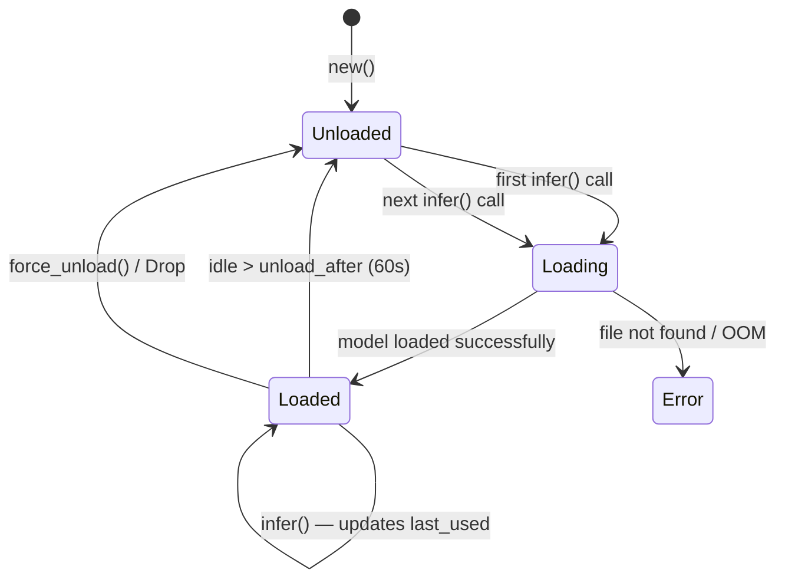
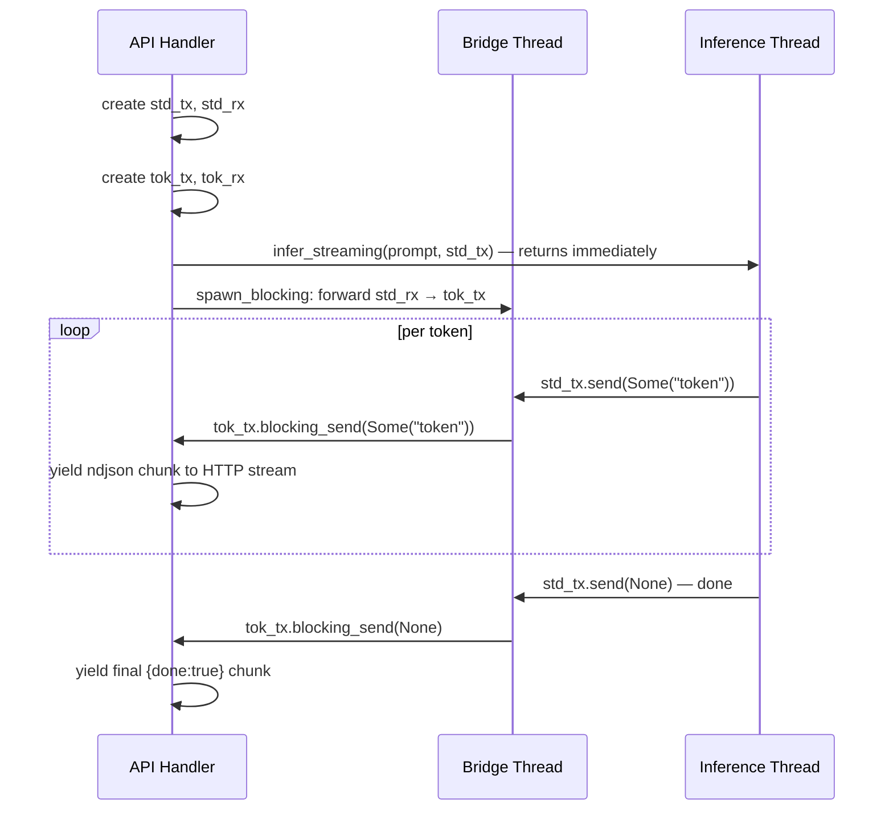
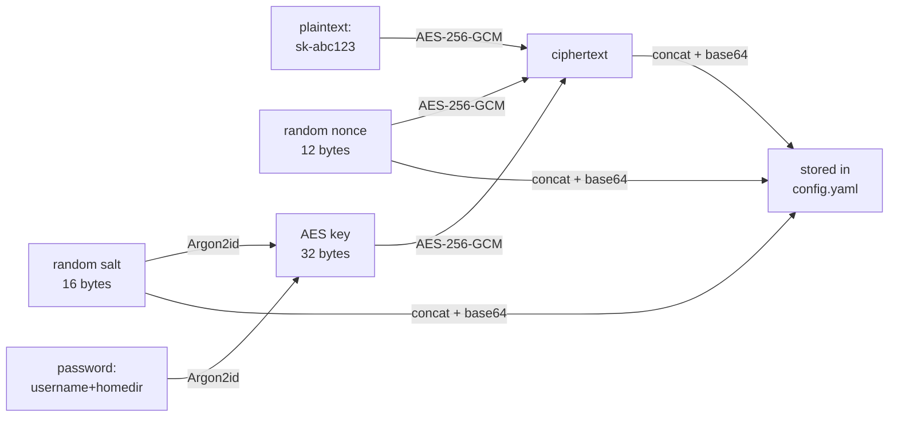

# Engine Module

The engine module is the core of Mithril: model loading, inference, chat formatting, and credential management.

**Location**: `src/engine/` + `src/config/`

---

## lazy_model.rs — LazyModelManager

Manages the lifecycle of a single GGUF model: lazy loading, inference, auto-unload, and graceful shutdown.

### Struct: `LazyModelManager`

```rust
pub struct LazyModelManager {
    model_path: PathBuf,
    unload_after: Duration,
    n_gpu_layers: u32,              // 99 on Apple Silicon (Metal), 0 elsewhere
    state: Arc<Mutex<ModelState>>,
    shutdown_tx: watch::Sender<bool>,
}
```

The `ModelState` stores both the model and backend together because `LlamaModelParams` is `!Send + !Sync`:

```rust
struct ModelState {
    model: Option<LlamaModel>,
    backend: Option<LlamaBackend>,
    last_used: Instant,
}
```

### Lazy loading lifecycle



### Method: `infer`

Runs blocking inference. Uses `std::thread::spawn` because `LlamaModel` is `!Send` and cannot cross the `tokio::spawn` boundary.

```
infer() call
  └─ std::thread::spawn
       ├─ load model if needed (Mutex lock)
       ├─ create context (4096 tokens)
       ├─ tokenize prompt
       ├─ decode initial batch
       ├─ sample loop:
       │    ├─ LlamaSampler::temp(temperature)
       │    ├─ LlamaSampler::dist(42)
       │    ├─ stop on: is_eog_token / max_tokens / stop_string match
       │    └─ decode one token per step
       └─ return trimmed output
```

### Method: `infer_streaming`

Real token-by-token streaming via `std::sync::mpsc::SyncSender`:



The `SyncSender` has a buffer of 64 tokens. The inference thread is never blocked waiting for the HTTP layer to catch up unless the buffer is full.

### Error handling

All `unwrap()` calls removed from the inference path. Critical failures propagate as `Result<Err>`:

```rust
let model = guard.model.as_ref()
    .ok_or_else(|| anyhow!("Model not loaded"))?;
let backend = guard.backend.as_ref()
    .ok_or_else(|| anyhow!("Backend not initialized"))?;
```

### Graceful shutdown

`LazyModelManager` implements `Drop`:

```rust
impl Drop for LazyModelManager {
    fn drop(&mut self) {
        let _ = self.shutdown_tx.send(true); // stop auto-unload task
        self.force_unload();                 // release GPU memory
    }
}
```

The HTTP server also triggers `force_unload()` on SIGINT before exiting.

---

## chat_template.rs — Chat Formatting

Different model families require different prompt formats. This module converts `ChatMessage[]` to the correct string.

### Templates

| Enum variant | Models | Format |
|-------------|--------|--------|
| `ChatML` | Qwen, DeepSeek, Yi | `<\|im_start\|>role\ncontent<\|im_end\|>` |
| `Llama3` | Llama 3.x Instruct | `<\|start_header_id\|>role<\|end_header_id\|>\n\ncontent<\|eot_id\|>` |
| `Phi3` | Phi-3.x | `<\|role\|>\ncontent<\|end\|>` |

### Format example — ChatML

```
<|im_start|>system
You are a helpful coding assistant.<|im_end|>
<|im_start|>user
Explain ownership in Rust.<|im_end|>
<|im_start|>assistant
```

The assistant turn is always appended without a closing token so the model continues from there.

---

## model_catalog.rs — Model Registry

Compile-time constants for all supported models. No heap allocations.

### Supported models

| ID | Family | Template | Parameters | Quantization |
|----|--------|----------|-----------|-------------|
| `qwen-1.5b` | qwen2 | ChatML | 1.5B | Q4_K_M |
| `qwen-7b` | qwen2 | ChatML | 7B | Q4_K_M |
| `llama-8b` | llama | Llama3 | 8B | Q4_K_M |
| `deepseek-6.7b` | deepseek | ChatML | 6.7B | Q4_K_M |
| `phi-3.5` | phi3 | Phi3 | 3.8B | Q4_K_M |

### `find_model` normalization

Accepts both canonical IDs and Ollama-style names:

```rust
find_model("qwen-1.5b")            // → Some(qwen-1.5b)
find_model("qwen2.5-coder:1.5b")   // → Some(qwen-1.5b) — Ollama style
find_model("llama3.1:8b")          // → Some(llama-8b)   — Ollama style
find_model("unknown")              // → None
```

---

## config/mod.rs — Credentials and Settings

### Credential encryption: Argon2id + AES-256-GCM

**v2 format** (current):

```
base64( nonce[12] || salt[16] || ciphertext )
```

- **nonce**: 12 random bytes, unique per encryption
- **salt**: 16 random bytes, unique per encryption  
- **key**: derived via Argon2id (m=65536KB, t=3, p=1) — ~300ms per derivation
- **cipher**: AES-256-GCM authenticated encryption



**v1 legacy format** (auto-detected on read, no Argon2):

```
base64( nonce[12] || ciphertext )
```

Legacy credentials decrypt correctly but are **not automatically upgraded** — run `mithril config set <key> <value>` to re-encrypt with v2.

### In-memory security

Decrypted keys are stored in `Zeroizing<String>` from the `zeroize` crate. The memory is overwritten with zeros when the value is dropped:

```rust
pub fn get_credential(&self, name: &str) -> Result<Option<String>> {
    let z: Zeroizing<String> = decrypt_credential(encrypted)?;
    Ok(Some(z.to_string()))  // cloned out, original wiped on drop
}
```

### `MithrilConfig` fields

```rust
pub struct MithrilConfig {
    pub default_provider: String,      // "local" | "gemini" | "openai" | "anthropic"
    pub default_model: String,         // "qwen-1.5b"
    pub credentials: HashMap<String, String>,  // encrypted values
    pub providers: ProviderSettings,   // per-provider model + base_url
    pub terminal_sandbox: bool,        // default: true
}
```

### Terminal sandbox

When `terminal_sandbox = true` (default), the `run_terminal` tool rejects commands matching a denylist before execution:

```
rm -rf /          sudo             dd if=
mkfs              :(){ :|:& };:    > /dev/sd
chmod -R 777 /    shutdown         reboot
curl | sh         wget | sh
```

Disable via:
```bash
mithril config set terminal_sandbox false
```
