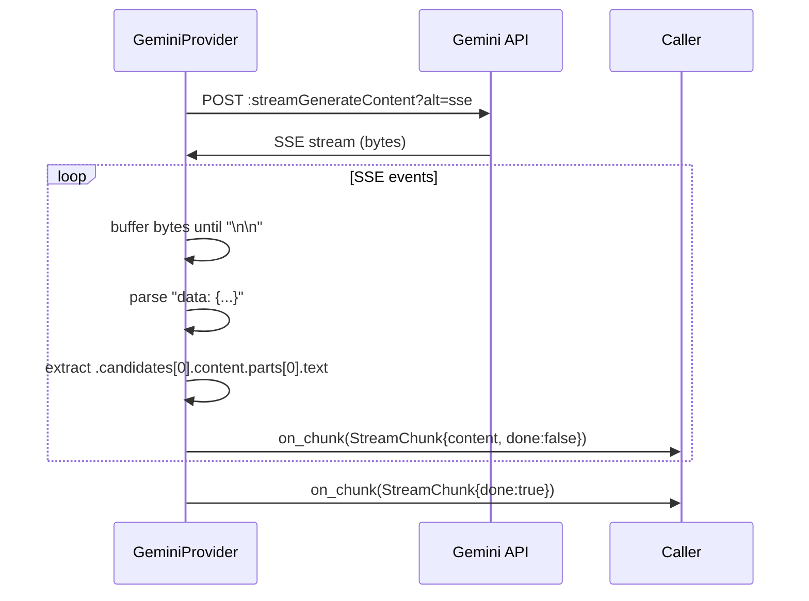
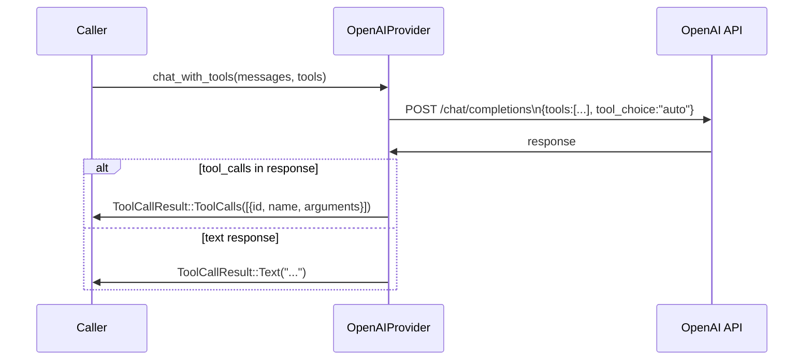
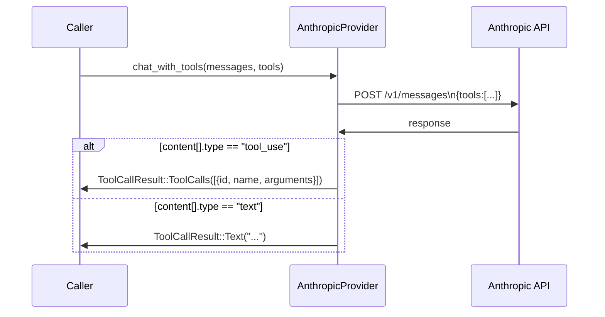

# Providers Module

The providers module implements a unified `ChatProvider` trait for local and cloud LLM backends, with real SSE streaming and tool calling support.

**Location**: `src/providers/`

---

## ChatProvider trait

```rust
#[async_trait]
pub trait ChatProvider: Send + Sync {
    fn name(&self) -> &str;
    fn model(&self) -> &str;

    /// Complete response (blocking until done)
    async fn chat(&self, messages: &[ChatMessage]) -> Result<String>;

    /// Token-by-token streaming via callback
    async fn chat_stream(
        &self,
        messages: &[ChatMessage],
        on_chunk: Box<dyn Fn(StreamChunk) + Send>,
    ) -> Result<String>;

    /// Tool calling support (default: falls back to plain chat)
    async fn chat_with_tools(
        &self,
        messages: &[ChatMessage],
        tools: &[ToolDefinition],
    ) -> Result<ToolCallResult>;

    async fn is_available(&self) -> bool;
}
```

### `ToolCallResult`

```rust
pub enum ToolCallResult {
    Text(String),           // LLM produced a final text response
    ToolCalls(Vec<ToolCall>), // LLM wants to invoke tools
}

pub struct ToolCall {
    pub id: String,
    pub name: String,
    pub arguments: HashMap<String, String>,
}
```

### `ToolDefinition`

```rust
pub struct ToolDefinition {
    pub name: String,
    pub description: String,
    pub parameters: serde_json::Value,  // JSON Schema object
}

// Build from ToolRegistry:
ToolDefinition::from_registry_tool(registry.get("read_psi").unwrap())
```

---

## Provider comparison

| Provider | `chat` | `chat_stream` | `chat_with_tools` | Notes |
|----------|--------|--------------|-------------------|-------|
| `local` | ✅ | ✅ real mpsc | ✅ (tool loop) | GGUF via llama.cpp |
| `gemini` | ✅ | ✅ real SSE | ❌ (fallback) | `:streamGenerateContent` |
| `openai` | ✅ | ✅ real SSE | ✅ native | `tool_calls` in response |
| `anthropic` | ✅ | ✅ real SSE | ✅ native | `tool_use` content block |

---

## LocalProvider

Wraps `LazyModelManager` for local GGUF inference.

```rust
pub fn new(model_id: &str) -> Result<Self>
```

**Errors:**
- Unknown model ID → `anyhow::bail!("Unknown model: ...")`
- Model not downloaded → deferred to first `chat()` call

---

## GeminiProvider

Calls Google's Generative Language API with real SSE streaming.

### Non-streaming

```
POST https://generativelanguage.googleapis.com/v1beta/models/{model}:generateContent?key={key}
```

### Streaming

```
POST https://generativelanguage.googleapis.com/v1beta/models/{model}:streamGenerateContent?alt=sse&key={key}
```

The response is a standard SSE stream. Each event:

```
data: {"candidates":[{"content":{"parts":[{"text":"Hello"}],"role":"model"}},...]}
```

Mithril parses `candidates[0].content.parts[0].text` from each event and calls `on_chunk`.

### System message handling

Gemini has no `system` role. Mithril prepends system content to the first `user` message:

```
system: "You are a Rust expert."
user: "What is ownership?"

→ Gemini user message: "You are a Rust expert.\nWhat is ownership?"
```

### Streaming flow



---

## OpenAIProvider

Supports OpenAI and any compatible API (Azure, Groq, Together, Ollama, etc.).

### Constructor

```rust
pub fn new(api_key: String, model: &str, base_url: Option<String>) -> Self
// Default base_url: "https://api.openai.com/v1"
```

### Streaming

Uses `stream: true` in the request. Parses `data: {...}` SSE lines and extracts `choices[0].delta.content`.

### Tool calling — `chat_with_tools`



**Request format:**
```json
{
  "model": "gpt-4o-mini",
  "messages": [...],
  "tools": [
    {
      "type": "function",
      "function": {
        "name": "read_psi",
        "description": "Read the content of a file",
        "parameters": {
          "type": "object",
          "properties": { "target": { "type": "string" } },
          "required": ["target"]
        }
      }
    }
  ],
  "tool_choice": "auto"
}
```

**Response with tool calls:**
```json
{
  "choices": [{
    "message": {
      "role": "assistant",
      "tool_calls": [{
        "id": "call_abc",
        "type": "function",
        "function": {
          "name": "read_psi",
          "arguments": "{\"target\":\"src/main.rs\"}"
        }
      }]
    }
  }]
}
```

---

## AnthropicProvider

Calls Anthropic's Messages API with real SSE streaming and tool calling.

### Streaming

Uses `stream: true` in the request. Parses `event: content_block_delta` SSE events with `delta.type == "text_delta"`:

```
event: content_block_delta
data: {"type":"content_block_delta","index":0,"delta":{"type":"text_delta","text":"Hello"}}
```

### Tool calling — `chat_with_tools`



**Request format:**
```json
{
  "model": "claude-sonnet-4-20250514",
  "max_tokens": 4096,
  "tools": [
    {
      "name": "read_psi",
      "description": "Read the content of a file",
      "input_schema": {
        "type": "object",
        "properties": { "target": { "type": "string" } },
        "required": ["target"]
      }
    }
  ],
  "messages": [...]
}
```

**Response with tool use:**
```json
{
  "content": [
    {
      "type": "tool_use",
      "id": "toolu_abc",
      "name": "read_psi",
      "input": { "target": "src/main.rs" }
    }
  ]
}
```

---

## Provider factory

```rust
pub fn create_provider(name: &str, config: &MithrilConfig) -> Result<Box<dyn ChatProvider>>
```

| Name | Provider | Credential key |
|------|----------|---------------|
| `"local"` | `LocalProvider` | — |
| `"gemini"` | `GeminiProvider` | `gemini` |
| `"openai"` | `OpenAIProvider` | `openai` |
| `"anthropic"` | `AnthropicProvider` | `anthropic` |

```bash
# Configure credentials
mithril config set gemini    "AIza..."
mithril config set openai    "sk-..."
mithril config set anthropic "sk-ant-..."
```

---

## Usage example

```rust
use mithril::config::MithrilConfig;
use mithril::providers::{create_provider, ChatMessage, ToolDefinition};
use mithril::tools::create_default_registry;

let config = MithrilConfig::load()?;
let provider = create_provider("openai", &config)?;

// Plain chat
let messages = vec![ChatMessage::user("What is Rust?")];
let reply = provider.chat(&messages).await?;

// Streaming chat
provider.chat_stream(&messages, Box::new(|chunk| {
    if !chunk.done { print!("{}", chunk.content); }
})).await?;

// Tool calling
let registry = create_default_registry(".");
let tools: Vec<ToolDefinition> = registry.all()
    .iter()
    .map(|t| ToolDefinition::from_registry_tool(*t))
    .collect();

let result = provider.chat_with_tools(&messages, &tools).await?;
match result {
    ToolCallResult::Text(t) => println!("{t}"),
    ToolCallResult::ToolCalls(calls) => {
        for call in calls {
            println!("LLM wants to call {} with {:?}", call.name, call.arguments);
        }
    }
}
```
