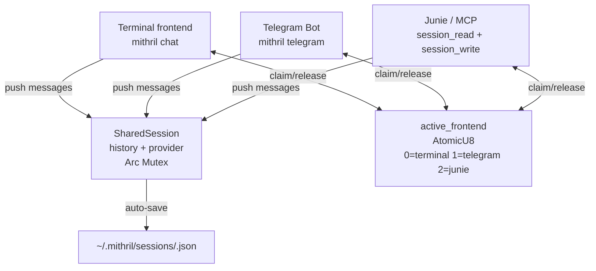
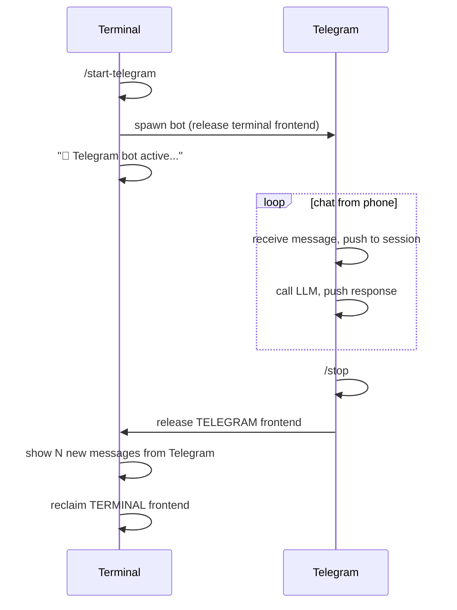

# Shared Sessions

Mithril sessions are persistent chat histories that can be handed off between frontends without losing context. Terminal, Telegram, and Junie (via MCP) all share the same `Vec<ChatMessage>` through an `Arc<Mutex<...>>`.

---

## Architecture



**Exclusivity**: only one frontend is active at a time. If a second frontend tries to claim while another is active, it gets an error. The `/stop` command from Telegram or `/start-terminal` from chat releases the current frontend.

---

## Session File Format

Sessions are stored at `~/.mithril/sessions/<uuid>.json`:

```json
{
  "id": "a3f7b291-...",
  "fellowship_name": "default",
  "messages": [
    { "role": "user",      "content": "I'm working on a bug in auth.rs" },
    { "role": "assistant", "content": "Let me read the file..." },
    { "role": "user",      "content": "Found it — unwrap() on line 42" }
  ],
  "created_at": "2026-08-03T10:00:00Z",
  "updated_at": "2026-08-03T10:15:00Z"
}
```

Every `push()` call auto-saves. The file is always consistent — no data loss even if the process is killed.

---

## Terminal Frontend

Start a new session:

```bash
mithril chat
mithril chat fast-groq    # use a named fellowship
```

Resume an existing session:

```bash
mithril chat --session a3f7b291
# (first 8 chars of the UUID are enough for display; full ID required for load)
```

### Chat commands

| Command | Description |
|---------|-------------|
| `/session` | Show session ID, fellowship, message count, active frontend |
| `/history` | Show all messages with preview |
| `/clear` | Clear all messages (session file is updated) |
| `/exit` | Exit and save session |

### Transfer flow



---

## Telegram Frontend

### Setup

```bash
# 1. Create a bot on Telegram via @BotFather → get token
# 2. Store the token
mithril config set telegram "<your-bot-token>"
```

### Start standalone

```bash
mithril telegram                         # new session, auto-picks best cloud provider
mithril telegram --session a3f7b291      # resume existing session
```

### Transfer from terminal

```bash
mithril chat
> /start-telegram
  📱 Telegram bot active. Session: a3f7b2...
  Send a message to your bot to continue.
  Press Ctrl+C to return to terminal.
```

### Telegram commands

| Command | Description |
|---------|-------------|
| `/session` | Show session ID, provider, message count |
| `/stop` | Return control to terminal |

### Provider selection for Telegram

Mithril auto-selects the fastest available provider for mobile use:

```
Priority: gemini → openai → anthropic → local
```

The local GGUF model is used as fallback only if no cloud key is configured. For mobile, cloud providers give much faster responses.

---

## Junie / MCP Frontend

When Junie (or any MCP client) has access to the session tools, it can read and write the shared history.

### Enable via `/start-junie`

```bash
mithril chat
> /start-junie
  🤖 Session shared with Junie via MCP.
  Session ID: a3f7b291...
  Junie can now call session_read and session_write via MCP tools.
  Run /start-terminal to return to terminal.
```

### MCP tools

**`session_read`** — returns the full conversation history as a JSON array:

```json
// MCP request
{"method": "tools/call", "params": {"name": "session_read", "arguments": {}}}

// Response
[
  {"role": "user",      "content": "I was working on auth.rs"},
  {"role": "assistant", "content": "I remember — the unwrap on line 42..."}
]
```

**`session_write`** — appends a message to the shared history:

```json
// MCP request
{
  "method": "tools/call",
  "params": {
    "name": "session_write",
    "arguments": {
      "role": "user",
      "content": "Junie found another issue in line 87"
    }
  }
}
```

### Use case: context handoff to Junie

```bash
mithril chat
> I've been debugging auth.rs, the token validation logic is broken
> /start-junie
  🤖 Session shared with Junie.

# In IntelliJ, Junie calls session_read → sees full context
# Junie knows what you were debugging without you repeating it
```

---

## Session Management CLI

```bash
# List all saved sessions (sorted by last update)
mithril sessions list

# Output:
# a3f7b291  gemini    12 msg  2026-08-03 10:15  mithril chat --session a3f7b291-...
# 9c14d820  local      3 msg  2026-08-02 09:30  mithril chat --session 9c14d820-...

# Show full history of a session
mithril sessions show a3f7b291

# Delete a session
mithril sessions delete a3f7b291
```

---

## SharedSession API (Rust)

For embedding Mithril in other projects:

```rust
use mithril::session::{SharedSession, FRONTEND_TERMINAL, FRONTEND_TELEGRAM};

// Create a new session
let session = SharedSession::new("default");  // fellowship name
println!("Session ID: {}", session.id);

// Add messages
session.push(ChatMessage::user("Hello!"));
session.push(ChatMessage::assistant("Hi there!"));

// Claim a frontend (exclusive)
session.claim_frontend(FRONTEND_TELEGRAM)?;

// Get new messages since offset
let new_msgs = session.messages_since(2);

// Release frontend
session.release_frontend(FRONTEND_TELEGRAM);

// Save / load
session.save()?;
let loaded = SharedSession::load(&session.id)?;

// List all sessions
let all = mithril::session::list_sessions()?;
```

---

## Storage Layout

```
~/.mithril/
├── sessions/
│   ├── a3f7b291-1234-5678-abcd-000000000001.json
│   ├── 9c14d820-...json
│   └── ...
├── models/
│   └── qwen2.5-coder-1.5b-instruct-q4_k_m.gguf
├── config.yaml
└── chat_history.txt    ← readline command history (not session content)
```

Sessions are plain JSON — human-readable and easily backed up or synced via cloud storage.
