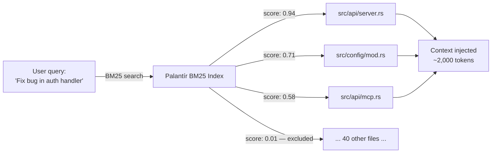
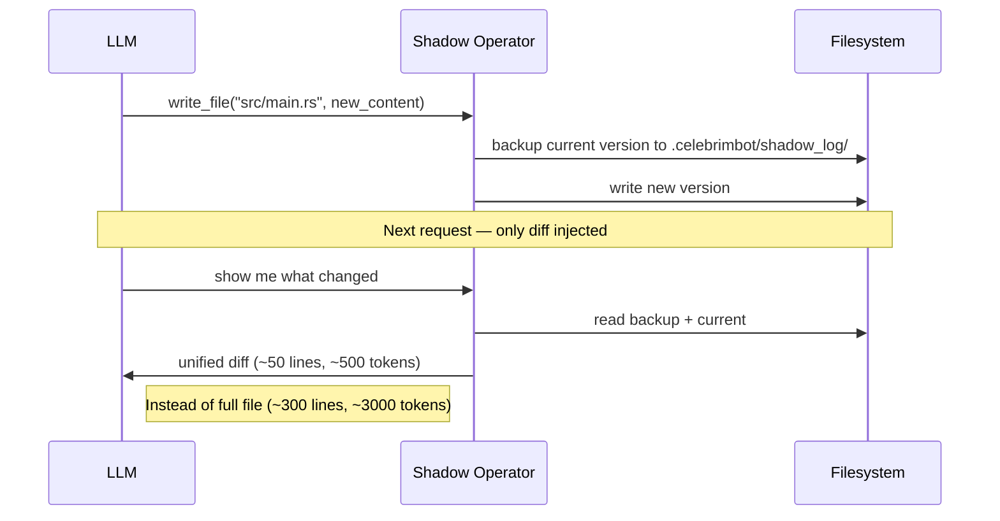
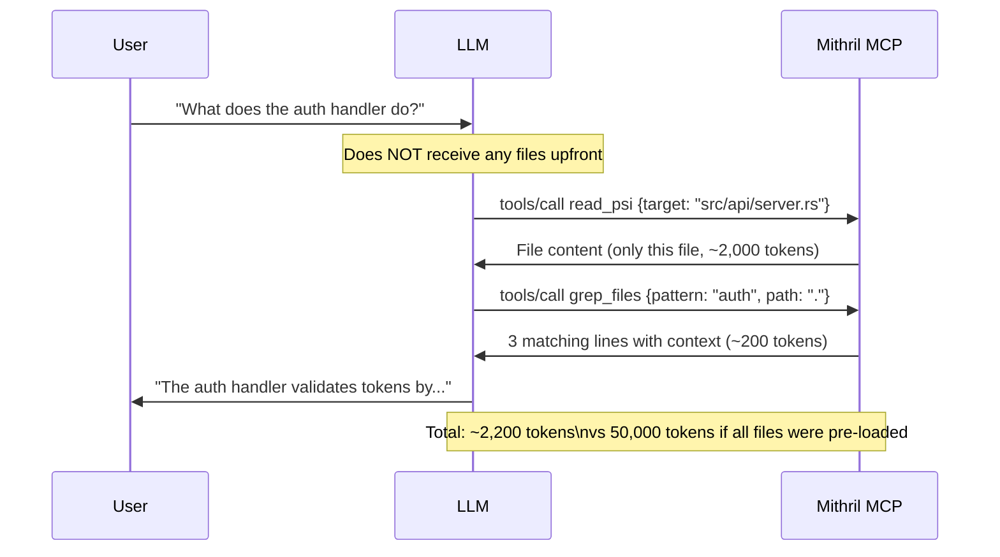
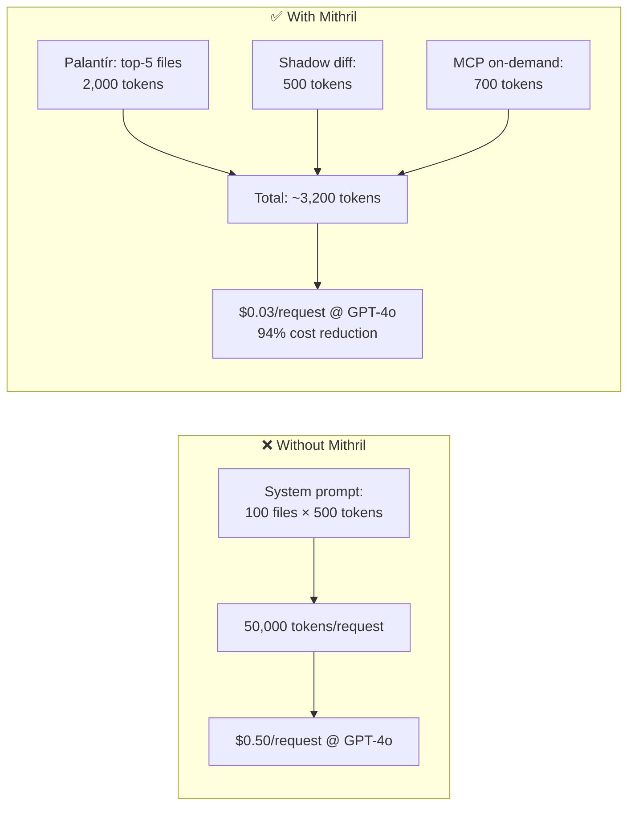

# Token Efficiency

Mithril has three independent mechanisms that dramatically reduce the number of tokens sent to the LLM on every request. This matters both for cost (cloud providers) and speed (local models).

---

## The Problem: Naive context injection

A typical AI coding assistant injects the entire project into the system prompt on every request:

```
System prompt:
  "You are a coding assistant. Here is the full project:"
  [src/main.rs — 300 lines]
  [src/lib.rs — 800 lines]
  [src/api/server.rs — 200 lines]
  ... 40 more files ...
  
User: "Fix the bug in the auth handler"
```

This costs **30,000–100,000 tokens per request** on a medium-sized project.

---

## Mechanism 1 — Palantír BM25 Index



### How it works

1. Run `mithril scan` once per project — builds a BM25 index over all source files
2. The index is stored in `.celebrimbot/palantir_index.json`
3. On every request, the query is tokenized and scored against all documents
4. Only the top-N files (default: 5) are injected into the prompt

### BM25 scoring

BM25 (Best Match 25) is the industry-standard IR algorithm used by Elasticsearch and Solr. Mithril uses:
- **k₁ = 1.5** — term frequency saturation
- **b = 0.75** — length normalization
- **Robertson-Sparck Jones IDF** — inverse document frequency

Files with low relevance scores are excluded entirely — they never reach the LLM.

### Token savings

| Project size | Naive approach | With Palantír | Saving |
|-------------|---------------|---------------|--------|
| 10 files | ~5,000 tokens | ~2,000 tokens | 60% |
| 50 files | ~25,000 tokens | ~2,000 tokens | 92% |
| 200 files | ~100,000 tokens | ~2,000 tokens | 98% |

### Symbol extraction

The Palantír index also extracts symbols per file (functions, structs, traits, classes) by language:

| Language | Extracted patterns |
|----------|--------------------|
| Rust | `fn`, `struct`, `enum`, `trait`, `impl`, `mod`, `const` |
| Python | `def`, `class` |
| TypeScript/JS | `function`, `class`, `const`, `interface` |
| Go | `func`, `type`, `struct` |
| Java | `class`, `interface`, `void`, `public` |

Symbols boost relevance scoring for queries like "where is `validate_command` defined?".

### Incremental updates

The index is **stale-aware**: files are only re-indexed if their content has changed. A 20% stale threshold triggers a rebuild of changed files while reusing the rest.

```bash
# Build index (first time: ~2s for 100 files)
mithril scan

# Subsequent runs: only changed files are re-indexed (~0.1s)
mithril scan
```

---

## Mechanism 2 — Shadow Log Diff



### How it works

1. Every `write_file` tool call creates a backup in `.celebrimbot/shadow_log/session_<timestamp>/`
2. On the next request, the LLM can ask for diffs instead of full file content
3. `mithril undo` reverts all writes in the last session

### Token savings

| File size | Full file | Diff after small change | Saving |
|-----------|-----------|------------------------|--------|
| 100 lines | ~1,000 tokens | ~80 tokens | 92% |
| 500 lines | ~5,000 tokens | ~200 tokens | 96% |
| 2,000 lines | ~20,000 tokens | ~500 tokens | 97.5% |

---

## Mechanism 3 — MCP On-Demand Tool Calling



### How it works

Instead of loading all files into the system prompt, the LLM:
1. Receives a short system prompt describing available tools
2. Reads only the files it actually needs, on demand
3. Uses `grep_files` to find relevant sections instead of reading everything

### Tool call overhead

Each MCP tool call adds ~200 tokens (tool definition + call + result). But this is far cheaper than injecting unused files:

```
Pre-loaded approach:
  System prompt: 50 files × 500 tokens = 25,000 tokens
  Per request overhead: 25,000 tokens

On-demand approach:
  System prompt: 200 tokens (tool descriptions)
  Per tool call: ~200 tokens
  Typical session: 5 calls × 200 tokens = 1,000 tokens
  Total: 1,200 tokens (95% less)
```

---

## Combined effect

In a typical coding session with Mithril + Junie on a 100-file project:



| Metric | Without Mithril | With Mithril | Improvement |
|--------|----------------|--------------|-------------|
| Tokens/request | ~50,000 | ~3,200 | **−94%** |
| Cost @ GPT-4o | $0.50 | $0.03 | **−94%** |
| Local inference time | ~180s (qwen-7b) | ~12s (qwen-7b) | **−93%** |
| Context window used | 100% (often overflow) | 6% | **Fits any model** |

---

## Configuration

### Palantír index location

```
.celebrimbot/palantir_index.json   # in project root
```

### Shadow log location

```
.celebrimbot/shadow_log/           # in project root
```

Both directories are automatically added to `.gitignore`.

### Adjusting top-N files injected

The number of files returned by Palantír is set in `src/index/palantir.rs`:

```rust
// Default: top 5 files per query
pub fn query(&self, query: &str, top_n: usize) -> Vec<SearchResult>
```

Pass a different `top_n` value when calling from your integration.

---

## Best practices

1. **Always run `mithril scan` after cloning** — the index is not committed to git
2. **Re-scan after large refactors** — new files won't appear in results until indexed
3. **Use `grep_files` before `read_psi`** — read a whole file only when grep narrows it down
4. **Keep sessions short** — shadow log groups writes per session; `mithril undo` reverts one session at a time
5. **Use `git_diff` instead of `read_psi`** — after making changes, ask for `git_diff` rather than re-reading modified files
